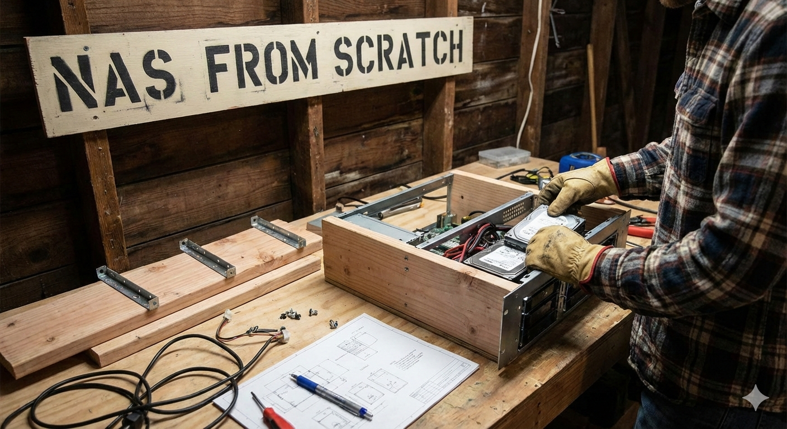
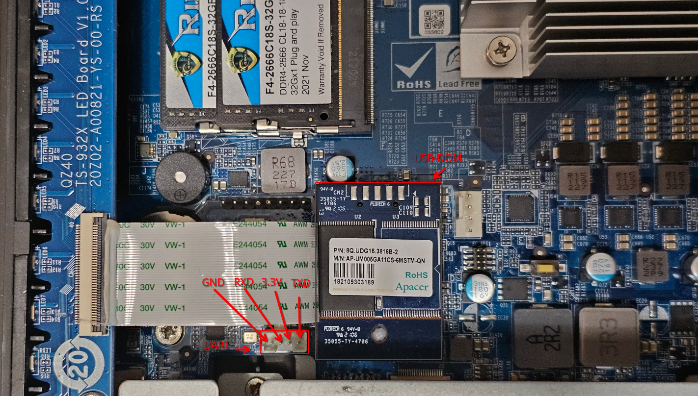
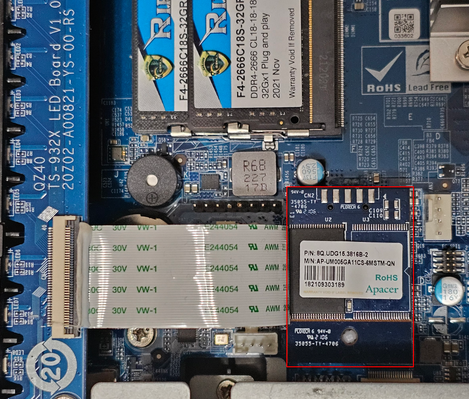
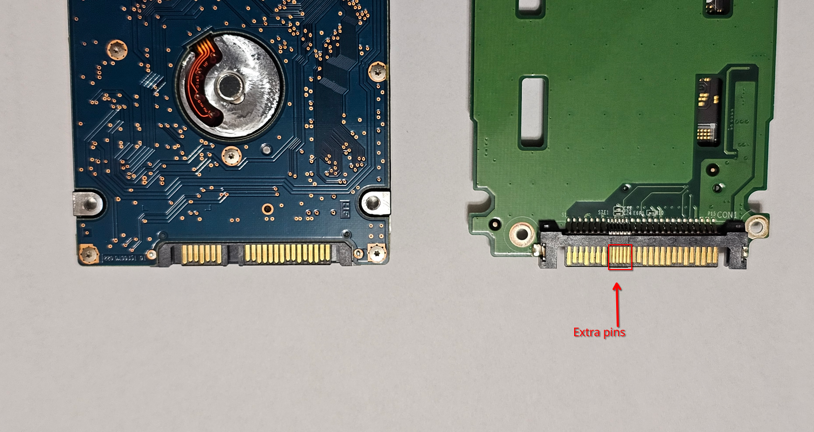
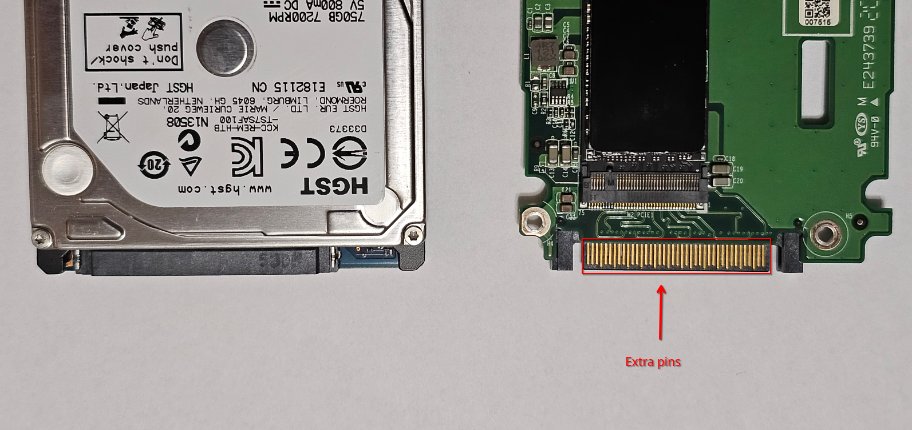
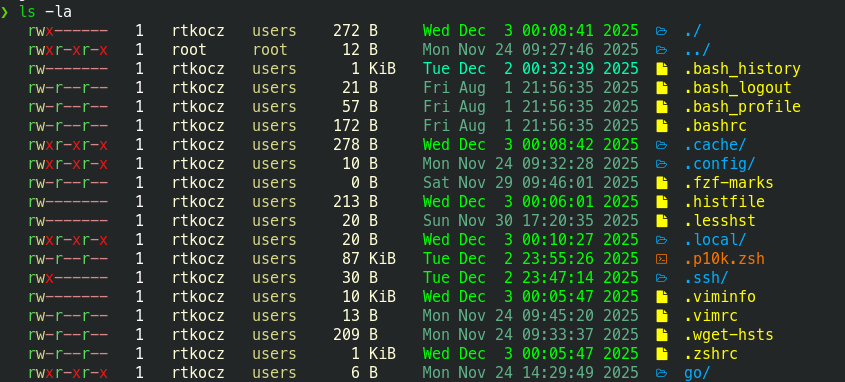

# Qnap TS-h973AX - NAS server from scratch

- [Qnap TS-h973AX - NAS server from scratch](#qnap-ts-h973ax---nas-server-from-scratch)
- [Board](#board)
  - [Specification](#specification)
  - [UART](#uart)
    - [Investigation](#investigation)
    - [Useful debug command](#useful-debug-command)
  - [BIOS](#bios)
    - [Boot order](#boot-order)
- [Linux](#linux)
  - [Kernel parameters](#kernel-parameters)
  - [Checklist before partitioning](#checklist-before-partitioning)
  - [Partition encryption](#partition-encryption)
    - [Recovery password](#recovery-password)
    - [Binary key file](#binary-key-file)
    - [TPM \& TANG](#tpm--tang)
    - [Decrypt luks partition](#decrypt-luks-partition)
    - [Use dedicate AMD Encryption controller](#use-dedicate-amd-encryption-controller)
  - [UART fix](#uart-fix)
- [Arch installation](#arch-installation)
  - [OS disk preparation](#os-disk-preparation)
  - [Encryption (/)](#encryption-)
  - [Logical Volume Manager (LVM)](#logical-volume-manager-lvm)
  - [BTRFS file system](#btrfs-file-system)
  - [EFI preparing (/boot)](#efi-preparing-boot)
  - [Mount layout](#mount-layout)
  - [Basic settings, packages, users](#basic-settings-packages-users)
    - [System initialization](#system-initialization)
    - [Locale](#locale)
    - [Users and permission](#users-and-permission)
    - [Pacman configure](#pacman-configure)
      - [Install basic packages](#install-basic-packages)
    - [Service to enable](#service-to-enable)
    - [Install YAY](#install-yay)
    - [AUR packages](#aur-packages)
    - [Configure network](#configure-network)
      - [Useful command](#useful-command)
    - [Initramfs image](#initramfs-image)
    - [UEFI boot manager](#uefi-boot-manager)
  - [After first boot](#after-first-boot)
    - [Other basic settings](#other-basic-settings)
      - [Resolver](#resolver)
      - [Propagation dotfile](#propagation-dotfile)
      - [Timezone and date](#timezone-and-date)
      - [Hostname](#hostname)
      - [Locale (again)](#locale-again)
    - [OS optimization](#os-optimization)
      - [Network](#network)
      - [RAM/IO (cache, inotify)](#ramio-cache-inotify)
      - [RAID](#raid)
      - [Agetty with UART](#agetty-with-uart)
- [NAS Server](#nas-server)
  - [Disk Topology](#disk-topology)
  - [NVMe cache](#nvme-cache)
  - [Shared files (Media and Private)](#shared-files-media-and-private)
    - [Partition](#partition)
    - [RAID6](#raid6)
    - [Encryption](#encryption)
    - [LVM](#lvm)
    - [BTRFS](#btrfs)
      - [Media](#media)
      - [Private](#private)
    - [Samba](#samba)
      - [Advertising SAMBA (mDNS)](#advertising-samba-mdns)
      - [Windows compatibility](#windows-compatibility)
      - [Create Samba user](#create-samba-user)
      - [Name Service Switch](#name-service-switch)
    - [DLNA](#dlna)
      - [ReadyMedia (MiniDLNA)](#readymedia-minidlna)
      - [Gerbera Media Server](#gerbera-media-server)
  - [ISCSI](#iscsi)
    - [Partition](#partition-1)
    - [Encryption](#encryption-1)
    - [LVM](#lvm-1)
    - [RAID1](#raid1)
    - [BTRFS](#btrfs-1)
    - [Service](#service)
      - [ACL](#acl)
      - [Volume](#volume)
      - [Login](#login)
- [Maintenance](#maintenance)
  - [Postfix](#postfix)
  - [LVM](#lvm-2)
    - [Troubleshooting](#troubleshooting)
      - [vgcreate - `inconsistent logical block sizes`](#vgcreate---inconsistent-logical-block-sizes)
    - [Useful command](#useful-command-1)
  - [RAID](#raid-1)
    - [Mail notification](#mail-notification)
    - [Change the `md127` name](#change-the-md127-name)
  - [BTRFS](#btrfs-2)
    - [Chunks](#chunks)
    - [Scrub](#scrub)
  - [Samba](#samba-1)
    - [Useful command](#useful-command-2)
  - [S.M.A.R.T.](#smart)
  - [Disk power managed - hdparm](#disk-power-managed---hdparm)
  - [Snapshots - snapper](#snapshots---snapper)
    - [Useful command](#useful-command-3)
  - [UPS - in progress](#ups---in-progress)
  - [ACPI custom DSDT - in progress](#acpi-custom-dsdt---in-progress)
  - [SSD TRIM](#ssd-trim)
- [Extra](#extra)
  - [ZSH](#zsh)
    - [Plugins](#plugins)
  - [mDNS scanner](#mdns-scanner)
  - [fstab](#fstab)

# Board

## Specification

The QNAP [TS-h973AX](https://www.qnap.com/en/product/ts-h973ax) is a 9-bay NAS server in a compact tower design.

Specification:

- CPU - AMD Ryzen™ Embedded V1500B 2.2 GHz 2 (8 treads)
- RAM - max 64GB DDR4 SO-DIMM
- Drive Bays - 9 bays
  - 5 x 3.5" SATA 6 Gb/s
  - 2 x 2.5" SATA 6 Gb/s / U.2 NVMe PCIe Gen 3 x4
  - 2 x 2.5" SATA 6 Gb/s
  - 1x USB-DOM 4G internal contain [QuTS hero](https://www.qnap.com/en/operating-system/quts-hero) OS
- Network - 3 ports
  - 1x 10GBase
  - 2x 2.5GBase
- USB
  - 1x USB-C 3.2 Gen 2 10Gb/s back
  - 2x USB-A 3.2 Gen 2 back
  - 1x USB-A 3.2 Gen 2 front

## UART

The TS-h973AX does not have a graphics card, but is capable of displaying information like POST, boot log information via UART interface.

Diagram showing how to connect the UART adapter to the QNAP TS-h973AX board, with particular attention to the correct connections between TXD and RXD:

```bash
   QNAP BOARD                           UART ADAPTER (USB)
   -----------                          -------------------
    [TXD] o------------------------->o [RXD]
    [RXD] o<-------------------------o [TXD]
    [GND] o--------------------------o [GND]
```

UART port location on the motherboard



UART parameters:

- baudrate -> 115200
- databits -> 8
- stopbits -> 1
- parity -> none
- flowcontrol -> none

You can use any UART terminal, for example, `picocom`

```bash
picocom -b 115200 -f n /dev/ttyUSB0
```

### Investigation

I've spent many hours trying to understand why `UART` works unstable and quickly hangs for never distribution like [Debian](https://www.debian.org), [Arch Linux](https://archlinux.org), [TrueNAS](https://www.truenas.com), but works stable during [POST messages](https://en.wikipedia.org/wiki/Power-on_self-test), [BIOS interaction](https://www.techtarget.com/whatis/definition/BIOS-basic-input-output-system) and **all the time** for [QuTS hero](https://www.qnap.com/en/operating-system/quts-hero).

- QuTS hero has an additional command in the [DSDT](https://wiki.archlinux.org/title/DSDT) table for ACPI that allows reconfiguring the UART (`UAR1`, `UAR2`) via an [ACPI calls](https://github.com/mkottman/acpi_call), but after trying to change the configuration it refused to turn on.

```bash
'\_SB.PCI0.UAR1._STA' - _STA: Port Status
'\_SB.PCI0.UAR1._CRS' - _CRS: Current Resource Settings
'\_SB.PCI0.SBRG.UAR1._DIS' - _DIS: Disable port
'\_SB.PCI0.SBRG.UAR1._SRS' - _SRS: Set Resource Settings
```

- In newer Linux distributions (with Kernel 6.X) which I tested on this board, the UART usually switched to [software flow control](https://en.wikipedia.org/wiki/Software_flow_control) mode automatically. Currently, I am forcing flow control to be disabled via kernel parameters, which makes the UART more stable. This is one-way communication (only receiving logs from Linux)

- After Linux boots, with dedicated [Kernel parameters](#kernel-parameters), the **bidirectional UART communication** is still a big problem. It doesn't matter if software flow control is used; the UART will quickly hang after interaction, when port is freezing, there is not possible to communicate with it, change settings, or even send echo to port `echo "test" > /dev/ttyS0`.

  There is a trick to unfreeze the port for a few seconds, just call this command  `cat /proc/tty/driver/serial`

  ```bash
  $ cat /proc/tty/driver/serial
    
  serinfo:1.0 driver revision:
  0: uart:16550A port:000003F8 irq:4 tx:15316 rx:417 RTS|DTR
  1: uart:16550A port:000002F8 irq:3 tx:0 rx:0
  ```

  For now, I discovered that switching the port from [IRQ](https://en.wikipedia.org/wiki/Interrupt_request) to [polling mode](https://en.wikipedia.org/wiki/Polling_(computer_science)) makes the UART stable for bidirectional communication, the disadvantage of polling mode is that the port slows down, but at least it is working.

  ```bash
  $ cat /proc/tty/driver/serial
  
  serinfo:1.0 driver revision:
  0: uart:16550A port:000003F8 irq:0 tx:16210 rx:465 RTS|DTR
  1: uart:16550A port:000002F8 irq:3 tx:0 rx:0
  ```

> [!NOTE]
> In section [UART fix](#uart-fix) is explained how to make polling mode permanent for each boot (`IRQ 4` -> `IRQ 0`)

### Useful debug command

- `cat /proc/tty/driver/serial` - UART status with flags/registry
- `fuser -v /dev/ttyS0` - shows which process is hanging/using the port, kill all processes with `-k`
- `echo on | sudo tee /sys/class/tty/ttyS0/device/power/control` - disable automatic power suspension
- `/sbin/setserial /dev/ttyS0 uart 16550A port 0x3f8 irq 0` - port using polling
- `/sbin/setserial /dev/ttyS0 uart 16550A port 0x3f8 irq 4` - port using IRQ
- `udevadm info -a -n /dev/ttyS0 | grep -E 'DRIVER|DEVPATH|SUBSYSTEM` - information about driver hierarchy under udev
- `stty -F /dev/ttyS0 -a` - UART configuration
- `lspci -k` - basic information about devices and drivers/modules

> [!NOTE]
> `setserial` can be installed from [AUR](https://aur.archlinux.org/packages/setserial)

## BIOS

It was mentioned that the UART works stably during POST messages and BIOS interaction, pressing `DEL` during POST allows you to enter BIOS

```bash
Version 2.20.1274. Copyright (C) 2021 American Megatrends, Inc.                 
BIOS Date: 07/21/2021 18:24:22 Ver: Q071AR10                                    
Press <DEL> or <ESC> to enter setup.
```

Useful BIOS settings:

- turn off the `BIOS Beep Function` - no more noise beep
- adapt the `Restore AC Power Loss` - this also can be changed from [QuTS hero](https://www.qnap.com/en/operating-system/quts-hero)
- update `Boot Option Priorities` - configure your own boot order

```bash
                 Aptio Setup Utility - Copyright (C) 2021 American Megatrends, Inc.                 
    Main  Advanced  Chipset  Security  Boot  Save & Exit                                            
+-----------------------------------------------------------------+--------------------------------+
|  Boot Configuration                                             |Select the keyboard NumLock     |
|  Bootup NumLock State                 [On]                      |state                           |
|  Quiet Boot                           [Disabled]                |                                |
|                                                                 |                                |
|  Boot Option Priorities                                         |                                |
|  Boot Option #1                       [UEFI OS (KINGSTON        |                                |
|                                       SNV3S500G)]               |                                |
|  Boot Option #2                       [KINGSTON SNV3S500G]      |                                |
|  Boot Option #3                       [UEFI: Built-in EFI       |                                |
|                                       Shell]                    |                                |
|                                                                 |                                |
|                                                                 |                                |
|                                                                 +--------------------------------+
|                                                                 |><: Select Screen               |
|                                                                 |space: Select Item              |
|                                                                 |Enter: Select                   |
|                                                                 |+/-: Change Opt.                |
|                                                                 |F1: General Help                |
|                                                                 |F2: Previous Values             |
|                                                                 |F3: Optimized Defaults          |
|                                                                 |F4: Save & Exit                 |
|                                                                 |ESC: Exit                       |
|                                                                 |                                |
|                                                                 |                                |
|                                                                 |                                |
|                                                                 |                                |
+-----------------------------------------------------------------+--------------------------------+
                  Version 2.20.1274. Copyright (C) 2021 American Megatrends, Inc.     
```

### Boot order

> [!IMPORTANT]
> This BIOS v2.20.1274 allowing to boot only from [USB device](https://en.wikipedia.org/wiki/USB) or [NVMe disk](https://en.wikipedia.org/wiki/NVM_Express).  
> [SATA disk](https://en.wikipedia.org/wiki/SATA) are not available in a `BOOT Option`.

There are two possibilities to make the boot work:

1. Use internal USB-DOM as an [EFI partition](https://en.wikipedia.org/wiki/EFI_system_partition), which will allow booting the operating system from the SATA drive.

   ```bash
   +-----------+      +-------------------------------+
   |           |      |                               |
   |  EFI      |      |        Root partition         |
   | Partition |      |                               |
   |           |      |                               |
   +-----------+      +-------------------------------+
   |  USB DOM  |      |            HDD                |
   |   (EFI)   |      |         (OS DATA)             |
   +-----------+      +-------------------------------+
   ```

   - **USB DOM** - Small USB device used to keep the EFI partition
   - **HDD** - SATA disk used for the operating system

   This configuration does not require any interaction with the `BOOT Option`, because the USB-DOM can be connected to another computer and prepared accordingly, and QNAP board will still try to read the EFI partitions from the USB-DOM.

   I used such adapter

   

   Remember to make a copy of the USB-DOM memory. Command `dd if=/dev/sda of=./qnap.img`

2. The TS-h973AX motherboard has two SATA/U.2 bay slots, which allow to use of the [QNAP U.2 NVMe adapter](https://eustore.qnap.com/qda-ump4.html) with an NVMe drive. Such an adapter gives the possibility to use NVMe at full speed and make it available as a boot option.

   This configuration requires interaction with the `BOOT Option`, and using an NVMe drive as a boot drive, but the speed gain is significant.

   ```bash
   +-------------------------------+
   |           |                   |
   |   EFI     |      Linus OS     |
   | Partition |                   |
   |           |                   |
   +-------------------------------+
   |           NVMe SSD            |
   |            1 disk             |
   +-----------+-------------------+
   ```

   **NVMe SSD**: Single NVMe disk for both `EFI` and `root`

> [!IMPORTANT]
> A standard NVMe-to-SATA adapter won't detect this drive as NVMe because it only uses the SATA interface for data transfer. Use a U.2 NVMe adapter with an SFF-8639 connector. To learn more about the QNAP adapter's design, see the images below.
>
>   
>   
>   

# Linux

## Kernel parameters

The following kernel parameters stabilize the UART **ONLY** when receiving logs (one-way communication), which allows you to observe the entire boot process.**The order of the parameters is important.**

Optimized, which working well

```bash
console=ttyS0,115200n8 \
  console=tty0 \
  loglevel=6 \
  8250.nr_uarts=2 \
  8250.skip_txen_test=1
```

For debug purpose, useful for other Linux distribution

```diff
+earlycon=uart8250,io,0x3f8,115200 \
  console=ttyS0,115200n8 \
  console=tty0 \
  loglevel=6 \
+ no_console_suspend \
  8250.nr_uarts=2 \
+ 8250.share_irqs=1 \
  8250.skip_txen_test=1
```

- `earlycon=uart8250,io,0x3f8,115200` - enables an early console on a legacy 8250 UART at I/O port `0x3f8`, `115200 bps`. This prints very-early kernel messages before the full TTY/driver stack is up. It’s simple, polled I/O—no interrupts, no [termios](https://en.wikibooks.org/wiki/Serial_Programming/termios), no flow control—meant purely for early boot logs.

- `console=ttyS0,115200n8` - adds a regular kernel console on `/dev/ttyS0` at `115200`, `8 data bits`, `no parity`, `1 stop bit`
  - Adding `r` to the end -> `ttyS0,115200n8` is enabling hardware [RTS/CTS](https://en.wikipedia.org/wiki/RS-232#RTS,_CTS,_and_RTR)  
  - [XON/XOFF](https://en.wikipedia.org/wiki/Software_flow_control) belongs to termios/user space, not the kernel console

- `console=tty0` - adds a console to the current virtual terminal (VGA). The last `console=` wins in the case of a `/dev/console` connection and becomes **primary**. This is a workaround for an unstable UART, which, if made primary, can freeze the entire boot process.

- `loglevel=6` - sets the console logging level to `INFO` (range is 0=emerg -> 7=debug).

- `8250.nr_uarts=2` - limit the driver to register at most 2 UART, this reduces probing/registration to a single port.

- `8250.share_irqs=1` - allow the 8250 driver to share IRQs with other devices.

- `8250.skip_txen_test=1` - it skips the “TX enable” sanity test used for some quirky UARTs during init.

## Checklist before partitioning

Typically, NVMe drives use a smaller block size of `512B`, which is slower than `4096B`, and also the different block sizes between the partition and the cache partition may lead to unstable operation or a drop in cache performance.

> [!WARNING]
>
> Changing the block size will result in the loss of all data and partitions on the disk.

Install `nvme-cli` from [aur](https://aur.archlinux.org/packages/nvme-cli-git), and after that, you can check the supported block sizes:

```bash
$ nvme id-ns /dev/nvme1n1 -H | grep -e "^LBA Format"

LBA Format  0 : Metadata Size: 0   bytes - Data Size: 512 bytes - Relative Performance: 0x2 Good (in use)
LBA Format  1 : Metadata Size: 0   bytes - Data Size: 4096 bytes - Relative Performance: 0x1 Better
```

`512 bytes` is in use, let's change the LBA format to `4096 bytes` -> `1`

```bash
nvme format /dev/nvme0n1 -l 1 --force
```

Validate change, if `4096 bytes` is in use

```bash
$ nvme id-ns /dev/nvme1n1 -H | grep -e "^LBA Format"

LBA Format  0 : Metadata Size: 0   bytes - Data Size: 512 bytes - Relative Performance: 0x2 Good 
LBA Format  1 : Metadata Size: 0   bytes - Data Size: 4096 bytes - Relative Performance: 0x1 Better (in use)
```

## Partition encryption

I realize that entering a password every time the NAS server boots can be inconvenient, even though the TS-h973AX board doesn't have a video card can be more difficult, but an unencrypted root partition where RAID passwords are stored also poses a serious security risk.

After trying different methods and taking into account the limitations (no graphics card), I decided to use [TPM](https://wiki.archlinux.org/title/Trusted_Platform_Module) + [TANG](https://github.com/latchset/tang) as a required condition to automatically unlock the encrypted root partition.

> [!TIP]
> How to configure a [TANG server](https://man.archlinux.org/man/tang.8.en). It is important to understand how it works and how to restore the `jwk` files required for disaster recovery. Back up your `jwk` files !!!

Required packages

```bash
pacman -S clevis jose tpm2-tools
```

Encryption performance depends on the hardware features supported, so a benchmark is important. [check this guide](https://wiki.archlinux.org/title/Dm-crypt/Device_encryption)

```bash
cryptsetup benchmark 

# Tests are approximate using memory only (no storage IO).
PBKDF2-sha1      1072163 iterations per second for 256-bit key
PBKDF2-sha256    2076388 iterations per second for 256-bit key
PBKDF2-sha512     688946 iterations per second for 256-bit key
PBKDF2-ripemd160  386643 iterations per second for 256-bit key
PBKDF2-whirlpool  274784 iterations per second for 256-bit key
argon2i       4 iterations, 924844 memory, 4 parallel threads (CPUs) for 256-bit key (requested 2000 ms time)
argon2id      4 iterations, 927845 memory, 4 parallel threads (CPUs) for 256-bit key (requested 2000 ms time)
#     Algorithm |       Key |      Encryption |      Decryption
        aes-cbc        128b       446.3 MiB/s       898.6 MiB/s
    serpent-cbc        128b        46.7 MiB/s       157.0 MiB/s
    twofish-cbc        128b        88.4 MiB/s       159.4 MiB/s
        aes-cbc        256b       349.6 MiB/s       853.7 MiB/s
    serpent-cbc        256b        46.7 MiB/s       157.0 MiB/s
    twofish-cbc        256b        88.4 MiB/s       159.4 MiB/s
        aes-xts        256b      1054.6 MiB/s      1054.1 MiB/s
    serpent-xts        256b       145.4 MiB/s       145.5 MiB/s
    twofish-xts        256b       148.0 MiB/s       147.7 MiB/s
        aes-xts        512b       951.1 MiB/s       950.5 MiB/s
    serpent-xts        512b       145.4 MiB/s       145.5 MiB/s
    twofish-xts        512b       144.4 MiB/s       147.6 MiB/s
```

### Recovery password

During encryption, `cryptsetup` asks for a static password. Create a strong password, as this will be the recovery password. This password will be stored in slot `0`.

```bash
cryptsetup luksFormat /dev/nvme0n1p2 -c aes-xts-plain64 -s 256 -h sha512
```

### Binary key file

A binary key file is one option for unlocking a partition. I recommend using it as a backup on a USB drive. It can be helpful when you need to decrypt the main partition when the TPM + TANG method doesn't work.

Generate a binary key file, which can be stored on USB drive or NFS endpoint

```bash
dd bs=512 count=4 if=/dev/random iflag=fullblock | install -m 0600 /dev/stdin ./root.key
```

Add key file to Luks on slot `1`

```bash
cryptsetup luksAddKey /dev/nvme0n1p2 -S 1 root.key -h sha512
```

> [!TIP]
> Read this guide, about the [binary key file](https://wiki.archlinux.org/title/Dm-crypt/System_configuration#rd.luks.key)

Add following kernel parameter

- `rd.luks.key=XXXXXXXX=/path/to/keyfile:UUID=ZZZZZZZZ`, where `XXXXXXXX` is the UUID encrypted partition and `ZZZZZZZZ` is the UUID of partition where key is located.

- `rd.luks.options=XXXXXXXX=keyfile-timeout=10s`- without this options, Kernel will wait forever for binary key.

Instead of adding another kernel parameter, there is possibility to add this settings to `/etc/crypttab.initramfs` which during recreating of initramfs `mkinitcpio -P` will be included to initramfs-linux.img.

```conf
# /etc/crypttab.initramfs

luks_root    UUID=XXXXXXXX-XXXX-XXXX-XXXX-XXXXXXXXXXXX   /root.key:UUID=ZZZZZZZZ-ZZZZ-ZZZZ-ZZZZ-ZZZZZZZZZZZZ   luks,keyfile-timeout=10s
```

### TPM & TANG

Validate if TPM is working, in case of issue check this [guide](https://wiki.archlinux.org/title/Trusted_Platform_Module)

```bash
tpm2_pcrread sha256:7
  sha256:
    7 : 0x46R2AO92OXMV4QMJJNDXITEP33BR3FZXGVU01VC0B6XY8LIGEC51K8M00SCJ4DCJM
```

Check if TANG is accessible, in this scenario TANG server is exposed on `7500` port

```bash
curl http://tang.example.com:7500/adv
```

Read how the `clevis` condition [works](https://github.com/latchset/clevis?tab=readme-ov-file#pin-shamir-secret-sharing)

```bash
clevis luks bind -d /dev/nvme0n1p2 sss \
  '{"t":2,"pins":{
      "tpm2":{"pcr_ids":"7"},
      "tang":{"url":"http://tang.example.com:7500"}
    }}'
```

Validate if new key was added

```bash
cryptsetup luksDump /dev/nvme0n1p2 
```

```diff
...
+Keyslots:
+  2: luks2
+       Key:        256 bits
+       Priority:   normal
+       Cipher:     aes-xts-plain64
+       Cipher key: 256 bits
+       PBKDF:      pbkdf2
+       Hash:       sha256
+       Iterations: 1000
...
Tokens:
  0: systemd-recovery
        Keyslot:    0
+ 1: clevis
+       Keyslot:    2
...
```

### Decrypt luks partition

It's required to progress with the next steps, like LVM, BTRFS, etc.

```bash
cryptsetup open /dev/nvme0n1p2 luks_root
 ```

### Use dedicate AMD Encryption controller

AMD Encryption controller is detect  but Kernel report some issue.

```bash
10:00.2 Encryption controller: Advanced Micro Devices, Inc. [AMD] Raven/Raven2/FireFlight/Renoir/Cezanne Platform Security Processor
```

```bash
ccp 0000:10:00.2: ccp enabled
ccp 0000:10:00.2: psp: unable to access the device: you might be running a broken BIOS.
```

> [!CAUTION]
> Require investigation

## UART fix

In the [Board/UART](#uart) section, it was mentioned that in newer Linux `6.X` kernels, the UART interface is unstable, the trail leads to unstable IRQ 4 interrupt, and as a result to hangs during transmit/receive data. Switches to polling mode (timer-controlled) the UART operation is slower but stable.

On fresh installation, `UART` uses `IRQ 4`

```bash
$ cat /proc/tty/driver/serial

serinfo:1.0 driver revision:
0: uart:16550A port:000003F8 irq:4 tx:121 rx:0 RTS|DTR
1: uart:16550A port:000002F8 irq:3 tx:0 rx:0
```

Switch `IRQ 4` to `IRQ 0` (polling mode)

> [!TIP]
> `setserial` needs to be installed from [AUR](https://aur.archlinux.org/packages/setserial)

```bash
setserial /dev/ttyS0 uart 16550A port 0x3f8 irq 0
```

Validate chang

```bash
$ cat /proc/tty/driver/serial

serinfo:1.0 driver revision:
0: uart:16550A port:000003F8 irq:0 tx:450 rx:0 RTS|DTR
1: uart:16550A port:000002F8 irq:3 tx:0 rx:0
```

Turn off the power suspend for UART

```bash
echo on | sudo tee /sys/class/tty/ttyS0/device/power/control
```

To apply these changes automatically on every boot, create following `udev` rule:

```bash
# /etc/udev/rules.d/99-ttyS0-nopm.rules

KERNEL=="ttyS0", RUN+="/sbin/setserial /dev/ttyS0 uart 16550A port 0x3f8 irq 0"
ACTION=="add", SUBSYSTEM=="tty", KERNEL=="ttyS0", ATTR{device/power/control}="on"
```

# Arch installation

[Arch Linux Live distributions](https://wiki.archlinux.org/title/USB_flash_installation_medium) always boot with an SSH server already running. Simply setting a root password will allow you to successfully log in to the Arch Live distribution via SSH. The tricky part is that you need to set a `root` password without being able to see what you are doing, so wait a few minutes for the boot process to finish and then enter the command below (with a keyboard connected to the QNAP, of course).

```bash
passwd root
```

Repeat the password twice.

> [!TIP]
> I recommend understanding the entire flow because you have to execute these commands from memory
>
> ```bash
> passwd root
> New password: 
> Retype new password:
> passwd: password updated successfully
> ```

after that, you can use SSH to log in to Arch Live distribution (this IP `192.168.1.123` is just an example; you need to figure out the IP of Arch Live distribution)

```bash
ssh root@192.168.1.123
```

> [!NOTE]
> This installation process is just an extension of the excellent [Arch Installation Guide](<https://wiki.archlinux.org/title/Installation_guide>), which I recommend.

## OS disk preparation

Partitioning depends on the approach you choose, with or without a USB DOM (check [Boot Order](#boot-order) for more information). This guide uses a single NVMe drive for the entire system (without a USB DOM) with encryption, LVM and BTRFS as file system.

```bash
+-----------------+-------------------+
|                 |                   |
|  EFI Partition  |  Root partition   |
|     (VFAT)      |     (BTRFS)       |
|                 |                   |
|                 +-------------------+
|                 |                   |
|                 |       LVM         |
|                 |                   |
|                 +-------------------+
|                 |                   |
|                 |    cryptsetup     |
|                 |                   |
+-----------------+-------------------+
|               NVMe SSD              |
|                1 disk               |
+-------------------------------------+
```

Required disk configuration:

- Disk partition table need to use `GPT`
- EFI parition needs to use correct type `EFI System`
- OS parition should be `Linux filesystem`

```bash
$ fdisk /dev/nvme0n1 -l

Disk /dev/nvme0n1: 465.76 GiB, 500107862016 bytes, 976773168 sectors
Disk model: KINGSTON SNV3S500G                      
Units: sectors of 1 * 512 = 512 bytes
Sector size (logical/physical): 512 bytes / 512 bytes
I/O size (minimum/optimal): 512 bytes / 512 bytes
Disklabel type: gpt
Disk identifier: 5A741586-4E80-4CEF-A117-C69E2850E569

Device           Start       End   Sectors   Size Type
/dev/nvme0n1p1    2048   2099199   2097152     1G EFI System
/dev/nvme0n1p2 2099200 976773119 974673920 464.8G Linux filesystem
```

## Encryption (/)

Follow this [guide](#partition-encryption) to encrypt partition.

## Logical Volume Manager (LVM)

> [!TIP]
> Read this [guide](https://wiki.archlinux.org/title/Dm-crypt/Encrypting_an_entire_system) about LVM to understand all the following command and their consequences.

```bash
pvcreate /dev/mapper/luks_root
```

```bash
vgcreate vg_root /dev/mapper/luks_root
```

```bash
lvcreate -L 250G vg_root -n lv_root
```

## BTRFS file system

> [!TIP]
> Read this [guide](https://wiki.archlinux.org/title/Btrfs) about BTRFS to understand all the following command and their consequences.

In this configuration, subvolumes will be used for the following endpoints:

- `@` - `/` (root)
- `@home` - `/home`
- `@var_cache` - `/var/cache`

Format partition with `root` label

```bash
mkfs.btrfs -L root /dev/vg_root/lv_root
```

Mount the partition to create subvolumes

```bash
mount /dev/vg_root/lv_root /mnt
```

Create subvolume

```bash
btrfs subvolume create /mnt/@
btrfs subvolume create /mnt/@home
btrfs subvolume create /mnt/@var_cache
```

List all subvolumes

```bash
$ btrfs subvolume list -p /mnt

ID 256 gen 10 parent 5 top level 5 path @
ID 257 gen 10 parent 5 top level 5 path @home
ID 259 gen 11 parent 5 top level 5 path @var_cache
```

Make subvolume `@` as default

```bash
btrfs subvolume set-default 256 /mnt
```

Check default subvolume

```bash
btrfs subvolume get-default /mnt
```

> [!WARNING]
> Remember to unmount `lv_root`, because subvolumes will be used.

## EFI preparing (/boot)

Read this [guide](https://wiki.archlinux.org/title/EFI_system_partition) about EFI partition to understand required actions.

```bash
mkfs.vfat -F 32 /dev/nvme0n1p1
```

## Mount layout

Following picture, represent mount layout

```bash
/mnt
├── / (subvol=@)
│
├── /home (subvol=@home)
│
├── /var
│   └── /cache (subvol=@var_cache)
│
└── /boot (VFAT)
```

Execute commands

```bash
mount -o subvol=@,relatime,lazytime,autodefrag /dev/vg_root/lv_root /mnt

mkdir /mnt/home 
mkdir -p /mnt/var/cache
mkdir /mnt/boot  

mount /dev/nvme0n1p1 /mnt/boot
mount -o subvol=@home,relatime,lazytime,autodefrag /dev/vg_root/lv_root /mnt/home
mount -o subvol=@var_cache,compress=zstd:3,relatime,lazytime /dev/vg_root/lv_root /mnt/var/cache
```

> [!TIP]
> Read this [doc](https://btrfs.readthedocs.io/en/latest/ch-mount-options.html), to understand BTRFS mount options.

## Basic settings, packages, users

### System initialization

It requires that all system partitions are properly mounted in the `/mnt` directory, checking the visualization of the mount point layout and confirming that everything is in place.

```bash
$ lsblk

nvme0n1               259:0    0 465.8G  0 disk  
├─nvme0n1p1           259:1    0     1G  0 part  /mnt/boot
└─nvme0n1p2           259:2    0 464.8G  0 part  
  └─luks_root         253:0    0 464.7G  0 crypt 
    └─vg_root-lv_root 253:1    0   250G  0 lvm   /mnt/var/cache
                                                 /mnt/home
                                                 /mnt
```

Install basic packages

```bash
pacstrap /mnt amd-ucode base base-devel bash-completion \
  linux linux-headers linux-firmware openssh vim btrfs-progs
```

> [!IMPORTANT]
> Some issues may occur while creating the initramfs file. All will be fixed in the later steps.

```bash
==> Building image from preset: /etc/mkinitcpio.d/linux.preset: 'default'
==> Using default configuration file: '/etc/mkinitcpio.conf'
  -> -k /boot/vmlinuz-linux -g /boot/initramfs-linux.img
==> Starting build: '6.17.8-arch1-1'
  -> Running build hook: [base]
  -> Running build hook: [systemd]
  -> Running build hook: [autodetect]
  -> Running build hook: [microcode]
  -> Running build hook: [modconf]
  -> Running build hook: [kms]
  -> Running build hook: [keyboard]
  -> Running build hook: [keymap]
  -> Running build hook: [sd-vconsole]
==> ERROR: file not found: '/etc/vconsole.conf'
  -> Running build hook: [block]
  -> Running build hook: [filesystems]
  -> Running build hook: [fsck]
==> Generating module dependencies
==> Creating zstd-compressed initcpio image: '/boot/initramfs-linux.img'
==> WARNING: errors were encountered during the build. The image may not be complete.
error: command failed to execute correctly
```

Remember to generate `fstab`

```bash
genfstab -U -p /mnt > /mnt/etc/fstab
```

[Chroot](https://en.wikipedia.org/wiki/Chroot) to new OS

```bash
arch-chroot /mnt
```

### Locale

Set locale

```bash
echo "en_US.UTF-8 UTF-8" >  /etc/locale.gen
echo "pl_PL.UTF-8 UTF-8" >> /etc/locale.gen
```

```bash
locale-gen
```

```bash
localectl set-keymap pl2
```

> [!NOTE]
> command `localectl set-keymap pl2` need to be repeat after first boot,
> because `localectl` not fully working in a `chroot`

```bash
echo "KEYMAP=pl2" > /etc/vconsole.conf
```

### Users and permission

Set the `root` password

```bash
passwd root
```

Create user

```bash
useradd -g users -G wheel,lock -m -s /bin/bash my_user
passwd my_user
```

Modify `/etc/sudoers` via `visudo` command

```diff
...
 ## Uncomment to allow members of group wheel to execute any command
-# %wheel ALL=(ALL:ALL) ALL
+%wheel ALL=(ALL:ALL) ALL
...
```

### Pacman configure

```diff
...
-#Color
+Color
...
-#[multilib]
-#Include = /etc/pacman.d/mirrorlist
+[multilib]
+Include = /etc/pacman.d/mirrorlist
...
```

#### Install basic packages

```bash
pacman -Syy && \
pacman -S acpi \
  acpi_call \
  acpid \
  clevis \
  dmidecode \
  dosfstools \
  git \
  go \
  htop \
  iotop \
  lm_sensors \
  lsof \
  lvm2 \
  mdadm \
  minidlna \
  nvme-cli \
  ranger \
  samba \
  smartmontools \
  snapper \
  strace \
  sysstat \
  systemd-resolvconf \
  tpm2-tools \
  xfsprogs
```

> [!TIP]
> `acpi_call` should be replaced with  `acpi_call-dkms` if used LTS or different Kernel images

### Service to enable

```bash
systemctl enable acpid
systemctl enable blk-availability.service
systemctl enable sshd
systemctl enable systemd-networkd
systemctl enable systemd-resolved
```

- `acpid` - comes with a number of predefined actions for triggered events, such as what should happen when you press the Power button on your machine.

- `blk-availability` - responsible for managing the deactivation of LVM (Logical Volume Manager) devices and their associated filesystems during system shutdown.

- `sshd` -  is the OpenSSH server process. It listens to incoming connections using the SSH protocol and acts as the server for the protocol.

- `systemd-networkd` - is a system daemon that manages network configurations.

- `systemd-resolved` - is a systemd service that provides network name resolution to local applications via a D-Bus interface.

> [!IMPORTANT]
> Please note that some users are reporting issues with `blk-availability.service` where unmounting is done in the wrong order in some cases.

Example of logs when from `blk-availability.service`

```bash
Dec 08 23:36:23 qnap systemd[1]: Stopping Availability of block devices...
Dec 08 23:36:23 qnap blkdeactivate[2253]: Deactivating block devices:
Dec 08 23:36:23 qnap blkdeactivate[2253]:   [UMOUNT]: unmounting vg_files-lv_private (dm-18) mounted on /srv/private... done
Dec 08 23:36:23 qnap blkdeactivate[2253]:   [UMOUNT]: unmounting vg_files-lv_media (dm-13) mounted on /srv/media... done
Dec 08 23:36:23 qnap blkdeactivate[2253]:   [UMOUNT]: unmounting vg_iscsi-lv_iscsi (dm-14) mounted on /srv/iscsi... done
Dec 08 23:36:23 qnap blkdeactivate[2253]:   [UMOUNT]: unmounting vg_root-lv_root (dm-1) mounted on /home... skipping
Dec 08 23:36:24 qnap blkdeactivate[2253]:   [LVM]: deactivating Volume Group vg_files... done
Dec 08 23:36:24 qnap blkdeactivate[2253]:   [DM]: deactivating crypt device crypt_cache_files (dm-5)... done
Dec 08 23:36:24 qnap blkdeactivate[2253]:   [DM]: deactivating crypt device crypt_files (dm-3)... done
Dec 08 23:36:24 qnap blkdeactivate[2253]:   [MD]: deactivating raid6 device md0... done
Dec 08 23:36:25 qnap blkdeactivate[2253]:   [LVM]: deactivating Volume Group vg_iscsi... done
Dec 08 23:36:25 qnap blkdeactivate[2253]:   [DM]: deactivating crypt device crypt_cache_iscsi (dm-6)... done
Dec 08 23:36:25 qnap blkdeactivate[2253]:   [DM]: deactivating crypt device crypt_iscsi (dm-4)... done
Dec 08 23:36:25 qnap blkdeactivate[2253]:   [MD]: deactivating raid1 device md1... done
Dec 08 23:36:25 qnap systemd[1]: blk-availability.service: Deactivated successfully.
Dec 08 23:36:25 qnap systemd[1]: Stopped Availability of block devices.
Dec 08 23:36:25 qnap systemd[1]: blk-availability.service: Consumed 1.292s CPU time, 14.1M memory peak.
```

### Install YAY

Remember to switch to a regular user `my_user`

```bash
git clone https://aur.archlinux.org/yay.git
cd yay
makepkg -si
```

Enabling the editing function

```bash
yay --editmenu --save
```

### AUR packages

```bash
yay -S fzf-marks \
  mkinitcpio-systemd-extras \
  # mkinitcpio-systemd-root-password \
  setserial \
  fstabfmt \
```

### Configure network

> [!TIP]
> Read this [guide](https://www.freedesktop.org/software/systemd/man/latest/systemd.network.html) about network configuration via `systemd-networkd`.

```bash
# /etc/systemd/network/10-nic.network 

# Enable DHCPv4 on all physical ethernet links
[Match]
Kind=!*
Type=ether

[Network]
DHCP=ipv4
LLDP=true
EmitLLDP=yes
MulticastDNS=yes

[DHCPv4]
ClientIdentifier=mac
UseNTP=true
```

```bash
# /etc/systemd/network/10-nas0.link

[Match]
Type=ether
MACAddress=24:5e:be:5c:64:4f

[Link]
Name=nas0
MACAddressPolicy=persistent
AutoNegotiationFlowControl=yes
RxFlowControl=yes
TxFlowControl=yes
```

```bash
# /etc/systemd/network/20-iscsi0.link 

[Match]
Type=ether
MACAddress=24:5e:be:80:31:6a

[Link]
Name=iscsi0
MACAddressPolicy=persistent
AutoNegotiationFlowControl=yes
RxFlowControl=yes
TxFlowControl=yes
```

#### Useful command

Check flowcontrol

```bash
ethtool -a iscsi0                                                                                                                                    ✔  ⚡  66  00:22:53 
Pause parameters for iscsi0:
Autonegotiate:  on
RX:             on
TX:             on
```

Check the network neighbors

```bash
networkctl lldp
```

```bash
networkctl list

IDX LINK    TYPE     OPERATIONAL SETUP      
  1 lo      loopback carrier     unmanaged
  2 nas0    ether    routable    configured 
  3 iscsi0  ether    routable    configured 
  4 enp15s0 ether    no-carrier  configuring
```

### Initramfs image

The `mkinitcpio-systemd-extras` package will provide all the necessary hooks: sd-clevis, sd-network, sd-resolve. It is required to automatically unlock the root partition over the network; please read the [documentation](https://github.com/wolegis/mkinitcpio-systemd-extras/wiki) carefully.

Modules:

- `atlantic` - driver for 10G ethernet
- `igc` - driver for 2.5G ethernet
- `vfat` - driver to access `boot` partition during boot

Hooks:

- `btrfs` - adding all BTRFS modules, which can be helpful to fix root partition
- `mdadm_udev` - provide support for assembling RAID arrays via udev
- `sd-network` - adding [support](https://github.com/wolegis/mkinitcpio-systemd-extras/wiki/Networking) for network
- `sd-resolve` - adding [support](https://github.com/wolegis/mkinitcpio-systemd-extras/wiki/Name-Resolution) for resolving DNS names
- `sd-clevis` - adding [support](https://github.com/wolegis/mkinitcpio-systemd-extras/wiki/Clevis) for clevis
- `lvm2` - Adds the device mapper kernel module and the lvm tool to the image.

```bash
# /etc/mkinitcpio.conf

...
MODULES=(atlantic igc ethernet)
...

HOOKS=(base systemd btrfs autodetect microcode modconf kms keyboard sd-vconsole block mdadm_udev sd-network sd-resolve block sd-clevis sd-encrypt lvm2 filesystems fsck)
```

> [!CAUTION]
> `sd-resolve` require to create `/etc/hostname` -> `echo "qnap" > /etc/hostname`
>
> Remember to recreate initramfs `mkinitcpio -p linux`

### UEFI boot manager

Executing the command below will copy the necessary files and directories to `/boot` folder

```bash
bootctl install
```

then create an entry for boot with UART support, remember to update the `root` UUID  
(use `blkid` or `lsblk -f`)

```bash
# /boot/loader/entries/arch.conf

title Arch
linux /vmlinuz-linux
initrd /initramfs-linux.img
initrd /amd-ucode.img
options options rd.neednet=1 rd.luks.uuid=7f0cc063-e383-4244-b4cb-12e6c396947f root=UUID=e0ff3e81-a516-4dbf-8103-8503655db764 rw mitigations=auto audit=off console=ttyS0,115200n8 console=tty0 loglevel=6 8250.nr_uarts=2 8250.skip_txen_test=1  
```

> [!WARNING]
> you should be ready to reboot Qnap server,

## After first boot

### Other basic settings

#### Resolver

Check if `resolv.conf` is a symlink

```bash
$ ls -la /etc/resolv.conf 

lrwxrwxrwx 1 root root 37 Nov 24 09:33 /etc/resolv.conf -> /run/systemd/resolve/stub-resolv.conf
```

if not, fix it with the following command

```bash
ln -sf /run/systemd/resolve/stub-resolv.conf /etc/resolv.conf
```

```conf
#  /etc/systemd/resolved.conf

[Resolve]

FallbackDNS=1.1.1.1
MulticastDNS=yes
LLMNR=yes
Cache=no-negative
ReadEtcHosts=yes
StaleRetentionSec=0
# Domains=mydomain.internal if internal domain is used
```

```bash
systemctl restart systemd-resolved
```

#### Propagation dotfile

To propagate file configuration for each new user, add file to `/etc/skel`

```bash
cp .vimrc /etc/skel
```

```bash
cp .zshrc /etc/skel
```

Copy file to existing user

```bash
cp /etc/shel/* /home/my_user
```

#### Timezone and date

Set proper timezone

```bash
timedatectl set-timezone Europe/Warsaw
```

Enable NTP client

```bash
timedatectl set-ntp true
```

Validate

```bash
$ timedatectl timesync-status 


       Server: 89.250.197.242 (89.250.197.242)
Poll interval: 1min 4s (min: 32s; max 34min 8s)
         Leap: normal
      Version: 4
      Stratum: 4
    Reference: A29FC87B
    Precision: 1us (-20)
Root distance: 69.884ms (max: 5s)
       Offset: +3.568ms
        Delay: 568us
       Jitter: 1.348ms
 Packet count: 2
    Frequency: +0.000ppm
```

#### Hostname

```bash
hostnamectl hostname qnap
```

#### Locale (again)

Run this commands again, which will update the `/etc/vconsole.conf` file with the proper value

```bash
localectl set-keymap pl2
```

```bash
# /etc/vconsole.conf

KEYMAP=pl2
XKBLAYOUT=pl
XKBMODEL=pc105
XKBOPTIONS=terminate:ctrl_alt_bksp
```

### OS optimization

#### Network

```bash
# /etc/sysctl.d/99-nas-net.conf

net.core.rmem_max = 134217728
net.core.wmem_max = 134217728
net.core.netdev_max_backlog = 32768
net.ipv4.tcp_rmem = 4096 1048576 67108864
net.ipv4.tcp_wmem = 4096 1048576 67108864
net.core.default_qdisc = fq
net.ipv4.tcp_congestion_control = bbr
```

- `net.core.rmem_max = 134217728` (128 MiB)

   The hard upper limit for any socket’s receive buffer (all protocols, not just TCP). TCP’s auto-tuning won’t grow a socket above this cap.

- `net.core.wmem_max = 134217728` (128 MiB)

   The hard upper limit for any socket’s send buffer. TCP auto-tuning and apps can’t exceed this.

- `net.core.netdev_max_backlog` = 32768

   Max number of packets the kernel can queue per CPU on an interface’s ingress backlog when it can’t process them fast enough. If this fills up, packets are dropped before they reach sockets. A higher value helps absorb bursts on fast NICs.

- `net.ipv4.tcp_rmem` = 4096 1048576 67108864 (4 KiB, 1 MiB, 64 MiB)

  Per-TCP-socket receive buffer auto-tuning triplet: min / default (initial) / max in bytes.
  - The kernel starts near 1 MiB and can grow up to 64 MiB if the flow needs it (but never beyond rmem_max).
  - Larger max helps high-throughput, high-latency (“long fat”) links.

- `net.ipv4.tcp_wmem` = 4096 1048576 67108864 (4 KiB, 1 MiB, 64 MiB)

  Per-TCP-socket send buffer auto-tuning triplet: min / default / max in bytes.
  - The kernel starts near 1 MiB and can grow up to 64 MiB (but never beyond wmem_max).
  - Bigger max can improve single-flow throughput on high-bandwidth, higher-RTT paths.

- `net.core.default_qdisc` = fq

  Sets the default egress queuing discipline to FQ (Fair Queue). It creates per-flow queues and supports pacing, reducing head-of-line blocking and helping latency. It’s a good companion for modern congestion control like BBR. (Note: fq ≠ fq_codel; fq_codel also fights bufferbloat but in a different way.)

- `net.ipv4.tcp_congestion_control` = bbr

  Makes BBR the default TCP congestion control. BBR estimates bottleneck bandwidth and RTT to send at the path’s BDP, usually giving high throughput with low queueing delay. It works best with a pacing qdisc such as fq.

#### RAM/IO (cache, inotify)

```bash
# /etc/sysctl.d/99-nas-tuning.conf 

vm.dirty_background_bytes = 1073741824
vm.dirty_bytes            = 4294967296
vm.vfs_cache_pressure     = 50
fs.inotify.max_user_watches = 1048576
```

- `vm.dirty_background_bytes` = 1073741824 (1 GiB)

  When the total amount of dirty (not-yet-written) page cache in RAM exceeds 1 GiB, the kernel’s flusher threads start writing it to disk in the background. This is a start writing threshold, not a cap.

- `vm.dirty_bytes` = 4294967296 (4 GiB)

  A hard ceiling for dirty page cache. When total dirty data reaches 4 GiB, tasks that keep writing are throttled (they’ll synchronously write/slow down) until writeback clears space.
  - Because you’re using the *_bytes knobs, the percentage-based knobs (vm.dirty_ratio, vm.dirty_background_ratio) are ignored.
  - Rule of thumb: set dirty_background_bytes well below dirty_bytes (you did: 1 GiB < 4 GiB) so background writeback kicks in before writers hit the hard cap.

- `vm.vfs_cache_pressure` = 50

  Controls how aggressively the kernel reclaims the VFS inode/dentry caches versus page cache.
  - 100 is the neutral/default behavior.
  - 50 makes the kernel less aggressive about dropping inode/dentry caches, so it tends to keep filesystem metadata around longer. That can speed up path lookups and stat()-heavy workloads, at the cost of slightly less RAM available for file data cache and other uses.

- `fs.inotify.max_user_watches` = 1048576 (≈1.05 million)

  Maximum number of inotify watches per user. Higher limits are useful for tools like IDEs, file sync/backup daemons, or build systems that watch many directories.
  - Each watch consumes kernel memory (order of hundreds of bytes to ~1 KiB depending on kernel/build), so 1 M watches can mean hundreds of MiB of RAM reserved in the worst case. Make sure your system has headroom.

#### RAID

```bash
# /etc/sysctl.d/99-md-raid.conf

dev.raid.speed_limit_min = 50000
dev.raid.speed_limit_max = 800000
```

- `dev.raid.speed_limit_min` = 50000 (≈ 50,000 KiB/s ≈ 49 MiB/s ≈ 50 MB/s)

  A soft floor for MD RAID background operations (resync, rebuild/recovery, reshape, consistency check). The kernel will try to keep these tasks moving at at least ~50 MB/s when the system isn’t under heavy I/O pressure. It’s not an absolute guarantee, but it nudges the scheduler to give rebuild work enough I/O so it doesn’t starve.

- `dev.raid.speed_limit_max` = 800000 (≈ 800,000 KiB/s ≈ 781 MiB/s ≈ 0.78 GiB/s ≈ 800 MB/s)

  A throttle ceiling for those same background tasks. If the array and disks are fast enough, the kernel won’t let resync/rebuild exceed ~0.8 GB/s. Higher values finish rebuilds sooner (reducing time-at-risk) but can steal I/O from your applications while the operation runs.

#### Agetty with UART

After switching the UART to [polling mode](#uart-fix), agetty works correctly, there is no need to modify the service.

# NAS Server

## Disk Topology

```bash
Media & Private with cache writethrough

+----------------------+----------------------+----------------------+-----------------------+
|      subvolume       |       subvolume      |       subvolume      |       subvolume       |
|        @media        |       @snapshot      |        @private      |       @snapshot       |
|                      |                      |                      |                       |
+----------------------+----------------------+----------------------+-----------------------+
|                                                                                            |
|                                              BTRFS                                         |
|                                                                                            |
+-------------------------+----------------------+---------+-----------+---------+-----------+
|                         |                      |         |          |          |           |
|         LVM media       |      LVM private     |  cache  | metadata |  cache   |  metadata |
|                         |                      | (media) | (media)  |(private) | (private) |
+-------------------------+----------------------+---------+-----------+---------+-----------+
|                                                |                                           |
|                   RAID6 (mdadm)                |                                           |
|                                                |                                           |
+---------+---------+---------+---------+--------+-------------------------------------------+
|         |         |         |         |        |                                           |
|   sdc1  |   sdd1  |   sde1  |   sdf1  |  sdg1  |                  nvme0n1p1                |
|         |         |         |         |        |                                           |
+---------+---------+---------+---------+--------+-------------------------------------------+
```

```bash
ISCSI with cache writeback

+--------------------+-------------------+
|                                        |
|                 BTRFS                  |
|                                        |
+-------------------+--------------------+
|                   |         |          | 
|     LVM iscsi     |  cache  | metadata |
|                   |         |          |
+-------------------+--------------------+
|                   |                    |
|    RAID1 (mdadm)  |                    |
|                   |                    |
+---------+---------+--------------------+
|         |         |                    |
|   sda1  |   sdb1  |     nvme0n1p2      |
|         |         |                    |
+---------+---------+--------------------+
```

- `writethrough`:
  - Writes go to both the cache device and the origin device simultaneously.
  - Reads can be served from cache.
  - Improves read performance and is safe against cache failure.
  - Write performance is roughly the same as without caching.

- `writeback`:
  - Writes land in the cache first and are flushed to the origin later.
  - Delivers fast writes and strong overall performance,
  - Carries risk of data loss/inconsistency if the cache fails or power is lost (unless the cache has power-loss protection).

## NVMe cache

The cache will be built on `dm-cache` because there are two RAID arrays, which requires creating two partitions.

```bash
+----------------------+--------------------+
|                      |                    |
|    Media & Files     |       ISCSI        |
|        650GB         |       200GB        |
|                      |                    |
+----------------------+--------------------+
```

> [!TIP]
> It is a good practice not to allocate all the space of SSD disk, the free space can be used to replace the damaged memory.

```bash
Disk model: IR-SSDPR-P34B-01T-80                    
Units: sectors of 1 * 4096 = 4096 bytes
Sector size (logical/physical): 4096 bytes / 4096 bytes
I/O size (minimum/optimal): 4096 bytes / 4096 bytes
Disklabel type: gpt
Disk identifier: AA8AF26B-4AFA-47A0-B3B3-BBEE1F8B2D0A

Device             Start       End   Sectors  Size Type
/dev/nvme1n1p1       256 170393855 170393600  650G Linux filesystem
/dev/nvme1n1p2 170393856 222822655  52428800  200G Linux filesystem
```

## Shared files (Media and Private)

### Partition

Required disk configuration:

- Disk partition table need to use `GPT`
- OS parition needs be `Linux RAID`
- minimum 4 disk

```bash
Disk /dev/sdc: 3.64 TiB, 4000787030016 bytes, 7814037168 sectors
Disk model: WDC WD40EFZX-68A
Units: sectors of 1 * 512 = 512 bytes
Sector size (logical/physical): 512 bytes / 4096 bytes
I/O size (minimum/optimal): 4096 bytes / 4096 bytes
Disklabel type: gpt
Disk identifier: 3852A24F-D753-41A8-BAAF-CEFD322598BD

Device     Start        End    Sectors  Size Type
/dev/sdc1   2048 7814035455 7814033408  3.6T Linux RAID
```

### RAID6

```bash
mdadm --create /dev/md0 --level=6 \
  --raid-devices=5 \
  --metadata=1.2 \
  --chunk=256 --bitmap=internal \ 
  --name=files \
  /dev/sda1 /dev/sdb1 /dev/sdc1 /dev/sdd1 /dev/sde1
```

Add the RAID map to `/etc/mdadm.conf`

```bash
mdadm --detail --scan | tee /etc/mdadm.conf
```

which should give the following results

```conf
cat /etc/mdadm.conf 
ARRAY /dev/md0 metadata=1.2 UUID=e9ab286b:4d2232ae:fbb328ae:96b98307
```

Check the RAID status

```bash
$ cat /proc/mdstat

Personalities : [raid1] [raid4] [raid5] [raid6] 

md0 : active raid6 sde1[2] sdd1[1] sdf1[3] sdc1[0] sdg1[4]
      11720653824 blocks super 1.2 level 6, 256k chunk, algorithm 2 [5/5] [UUUUU]
      bitmap: 0/30 pages [0KB], 65536KB chunk

unused devices: <none>
```

### Encryption

> [!TIP]
> Before taking any action, please read the encryption [guide](#encryption-root).

```bash
cryptsetup luksFormat /dev/md0 -s 256 -c aes-xts-plain64 -h sha512
cryptsetup luksFormat /dev/nvme1n1p1 -s 256 -c aes-xts-plain64 -h sha512
```

To automatically unlock the encrypted partition on boot, create a binary key, please check this [guide](#binary-key-file)

```bash
dd bs=512 count=4 if=/dev/random iflag=fullblock | install -m 0600 /dev/stdin /etc/cryptsetup-keys.d/srv_files.key
dd bs=512 count=4 if=/dev/random iflag=fullblock | install -m 0600 /dev/stdin /etc/cryptsetup-keys.d/nvme_cache_files.key
```

```bash
# /etc/cryptsetup-keys.d

-rw------- 1 root root 2048 Nov  8 19:53 nvme_cache_files.key
-rw------- 1 root root 2048 Nov  8 19:52 srv_files.key
```

Then add the binary key to available slots

```bash
cryptsetup luksAddKey -S 7 /dev/md0 /etc/cryptsetup-keys.d/srv_files.key
cryptsetup luksAddKey -S 7 /dev/nvme1n1p1 /etc/cryptsetup-keys.d/nvme_cache_files.key
```

Update `crypttab`

```bash
# /etc/crypttab 

crypt_files         UUID=c4f4f635-762a-4102-a049-123456789011   /etc/cryptsetup-keys.d/srv_files.key            luks
crypt_cache_iscsi   UUID=8bf542fe-a3cd-4944-97fe-123456789011   /etc/cryptsetup-keys.d/nvme_cache_iscsi.key     luks
```

After `daemon-reload` it should create following services

```bash
systemctl daemon-reload 
```

Generate following services

```bash
systemctl status systemd-cryptsetup@crypt_cache_files.service
systemctl status systemd-cryptsetup@crypt_files.service
```

Start service to check if they unlock automatically

```bash
systemctl start systemd-cryptsetup@crypt_cache_files.service
systemctl start systemd-cryptsetup@crypt_files.service
```

> [!IMPORTANT]
>
> Add hook `sd-encrypt` after `mdadm_udev` to `/etc/mkinitcpio.conf`  
> `... block mdadm_udev sd-encrypt lvm2 btrfs filesystems fsck`

### LVM

```bash
pvcreate /dev/mapper/crypt_files /dev/mapper/crypt_cache_files
```

```bash
vgcreate vg_files /dev/mapper/crypt_files /dev/mapper/crypt_cache_files
```

Temporary block cache PV

```bash
pvchange -x n /dev/mapper/crypt_cache_files
```

```bash
lvcreate -l 6T -n lv_media vg_files /dev/mapper/crypt_files
lvcreate -L 100%FREE -n lv_private vg_files /dev/mapper/crypt_files
```

Unblock cache parition

```bash
pvchange -x y /dev/mapper/crypt_cache_files
```

Media cache partition

```bash
lvcreate -L 300G -n cachedata_media vg_files /dev/mapper/crypt_cache_files
lvcreate -L  12G -n cachemeta_media vg_files /dev/mapper/crypt_cache_files
```

Private cache partition

```bash
lvcreate -L 300G -n cachedata_private vg_files /dev/mapper/crypt_cache_files
lvcreate -L  12G -n cachemeta_private vg_files /dev/mapper/crypt_cache_files
```

> [!IMPORTANT]
>
> Add hook `lvm2` after `sd-encrypt` to `/etc/mkinitcpio.conf`  
> `... block mdadm_udev sd-encrypt lvm2 btrfs filesystems fsck`

Validate

```bash
lvs -a -o lv_name,segtype,cachemode,devices vg_files
  LV                              Type       CacheMode    Devices                              
  [cachedata_media_cpool]         cache-pool writethrough cachedata_media_cpool_cdata(0)       
  [cachedata_media_cpool_cdata]   linear                  /dev/mapper/crypt_cache_files(0)     
  [cachedata_media_cpool_cmeta]   linear                  /dev/mapper/crypt_cache_files(76800) 
  [cachedata_private_cpool]       cache-pool writethrough cachedata_private_cpool_cdata(0)     
  [cachedata_private_cpool_cdata] linear                  /dev/mapper/crypt_cache_files(82944) 
  [cachedata_private_cpool_cmeta] linear                  /dev/mapper/crypt_cache_files(159744)
  lv_media                        cache      writethrough lv_media_corig(0)                    
  [lv_media_corig]                linear                  /dev/mapper/crypt_files(0)           
  lv_private                      cache      writethrough lv_private_corig(0)                  
  [lv_private_corig]              linear                  /dev/mapper/crypt_files(1572864)     
  [lvol0_pmspare]                 linear                  /dev/mapper/crypt_cache_files(79872) 
```

### BTRFS

#### Media

Format partition with `16k` size of btree nodes

```bash
mkfs.btrfs -L media -n 16k /dev/vg_files/lv_media
```

Create `media` folder for partition mounting

```bash
mkdir /srv/media
```

Mount partition

```bash
mount /dev/vg_files/lv_media /srv/media
```

Create subvolume `@media`

```bash
btrfs subvolume create /srv/media/@media
```

Get a list of subvolumes

```bash
btrfs subvolume list /srv/media
ID 256 gen 10 top level 5 path @media
```

Set default subvolume

```bash
btrfs subvolume set-default 256 /srv/media
```

Unmount partition, because `media` will be mounted as `subvolume`

```bash
unmount /srv/media
```

Add entry to `/etc/fstab`

```bash
UUID=88af8746-217c-4f15-90b7-17b7aabaa113  /srv/media   btrfs   subvol=@media,noatime,compress=zstd,space_cache=v2   0 0
```

Mount all filesystems mentioned in fstab

```bash
mount -a
```

> [!TIP]
> Sometimes is required to run `systemctl daemon-reload`

Enable BTRFS quota

```bash
btrfs quota enable /srv/media/
```

#### Private

Format partition with `16k` size of btree nodes

```bash
mkfs.btrfs -L private -n 16k /dev/vg_files/lv_private
```

Create `private` folder for partition mounting

```bash
mkdir /srv/private
```

Mount partition

```bash
mount /dev/vg_files/lv_private /srv/private
```

Create subvolume `@private`

```bash
btrfs subvolume create /srv/private/@private
```

Get a list of subvolumes

```bash
btrfs subvolume list /srv/private
ID 256 gen 10 top level 5 path @private
```

Set default subvolume

```bash
btrfs subvolume set-default 256 /srv/private
```

Unmount partition, because `private` will be mounted as `subvolume`

```bash
unmount /srv/private
```

Add entry to `/etc/fstab`

```bash
UUID=424d6385-a1e1-48d9-bbf7-7627467be80d  /srv/private  btrfs  subvol=@private,noatime,compress=zstd,space_cache=v2,autodefrag  0 0
```

Mount all filesystems mentioned in fstab

```bash
mount -a
```

> [!TIP]
> Sometimes is required to run `systemctl daemon-reload`

Enable BTRFS quota

```bash
btrfs quota enable /srv/private
```

### Samba

Install samba package

```bash
pacman -S samba
```

```bash
# /etc/samba/smb.conf 

[global]
   disable netbios = yes
   server smb transports = 445
   unix extensions = no
   aio read size  = 1
   aio write size = 1
   use sendfile   = yes
   vfs objects    = io_uring

   server signing     = default
   server smb encrypt = desired
   log level = 1
   server min protocol = SMB2_10

   idmap config * : backend = tdb
   idmap config * : range = 200000-2147483647

[media]
   path = /srv/media
   read only = no
   browseable = yes

   vfs objects = io_uring catia fruit streams_xattr

   fruit:encoding          = native
   fruit:metadata          = stream
   fruit:resource          = stream
   fruit:posix_rename      = yes
   fruit:delete_empty_adfiles = yes
   ea support              = yes
   store dos attributes    = yes
   case sensitive          = auto

   veto files = /.snapshots/
   valid users = @smb-media
   force group = +smb-media

   create mask = 0664
   directory mask = 2775
   inherit acls = yes
   inherit permissions = yes

[private]
   path = /srv/private/%U
   read only = no
   browseable = yes

   valid users = %U
   force user = %U
   force group = root
   create mask = 0600
   directory mask = 0700
   veto files  = /.snapshots/

   root preexec = /usr/local/sbin/samba-mkdir-private.sh %U
   root preexec close = yes
```

Validate Samba config

```bash
testparm -s
```

Create dedicated `smb-media` group

```bash
groupadd --users my_user smb-media
```

```bash
chgrp smb-media /srv/media
```

```bash
chmod 2775 /srv/media
```

```bash
setfacl -m g:smb-media:rwx /srv/media
setfacl -m d:g:smb-media:rwx /srv/media
```

Add script

```bash
# cat /usr/local/sbin/samba-mkdir-private.sh

#!/bin/sh
u="$1"
base="/srv/private"
dir="$base/$u"
if [ ! -d "$dir" ]; then
  umask 077
  mkdir -p -- "$dir" || exit 1
  chown "$u" "$dir" || exit 1
  chmod 700 "$dir"
fi
exit 0
```

Enable and restart samba service

```bash
systemctl enable smb.service
systemctl start smb.service
```

#### Advertising SAMBA (mDNS)

By default, Samba wants to use mDNS through [Avahi](https://wiki.archlinux.org/title/Avahi), and it tries to start it via a [D-BUS](https://wiki.archlinux.org/title/D-Bus) request, so the Avahi service must be [masked](https://wiki.archlinux.org/title/Systemd).

```bash
systemctl mask avahi-daemon
```

I promote mDNS via [systemd-resolved](https://wiki.archlinux.org/title/Systemd-resolved).

> [!IMPORTANT]
> To make `+mDNS` working on interface, add  `MulticastDNS=yes` feature, check this [guide](https://wiki.archlinux.org/title/Systemd-networkd).

```diff
$ resolvectl

Global
           Protocols: -LLMNR +mDNS -DNSOverTLS DNSSEC=no/unsupported
    resolv.conf mode: stub
  Current DNS Server: 1.1.1.1
Fallback DNS Servers: 1.1.1.1

Link 2 (enp13s0)
    Current Scopes: none
-        Protocols: -DefaultRoute -LLMNR -mDNS -DNSOverTLS DNSSEC=no/unsupported
+        Protocols: -DefaultRoute -LLMNR +mDNS -DNSOverTLS DNSSEC=no/unsupported
     Default Route: no

Link 3 (enp14s0)
    Current Scopes: none
-        Protocols: -DefaultRoute -LLMNR -mDNS -DNSOverTLS DNSSEC=no/unsupported
+        Protocols: -DefaultRoute -LLMNR +mDNS -DNSOverTLS DNSSEC=no/unsupported
     Default Route: no

Link 4 (enp15s0)
    Current Scopes: DNS mDNS/IPv4 mDNS/IPv6
-        Protocols: +DefaultRoute -LLMNR -mDNS -DNSOverTLS DNSSEC=no/unsupported
+        Protocols: -DefaultRoute -LLMNR +mDNS -DNSOverTLS DNSSEC=no/unsupported
       DNS Servers: 1.1.1.1
     Default Route: yes
```

Create a folder to store the mDNS advertising configuration

```bash
mkdir -p /etc/systemd/dnssd
```

```ini
[Service]
Name=%H
Type=_smb._tcp
Port=445
TxtText=model=MacPro
```

Restart systemd-resolved service

```bash
systemctl restart systemd-resolved
```

Check the logs if the service does not report any problems

```bash
journalctl -u systemd-resolved
```

#### Windows compatibility

Install [wsdd](https://man.archlinux.org/man/extra/wsdd/wsdd.8.en) a daemon for advertising Samba service in Windows home network.

```bash
pacman -S wsdd
```

```bash
systemctl enable wsdd
systemctl start wsdd
```

#### Create Samba user

Create UNIX user without home directory and possibility to login

```bash
useradd -g users -G smb-media -M -s /usr/bin/nologin my_new_user
```

Validation

```bash
$ su my_new_user

This account is currently not available.
```

Set Samba password for new user

```bash
smbpasswd -a my_new_user
```

Show users status

```bash
pdbedit -L -v
```

#### Name Service Switch

Read this [guide](https://wiki.archlinux.org/title/Domain_name_resolution) to understand how Name Service Switch works.

```bash
# /etc/nsswitch.conf

passwd: files systemd
group: files [SUCCESS=merge] systemd
shadow: files systemd
gshadow: files systemd

publickey: files

hosts: files resolve [!UNAVAIL=return] dns myhostname
# in case of VM/dockers
# hosts: files resolve [!UNAVAIL=return] dns myhostname mymachines
networks: files

protocols: files
services: files
ethers: files
rpc: files

netgroup: files
```

### DLNA

#### ReadyMedia (MiniDLNA)

DLNA service is provided by [MiniDLNA](https://wiki.archlinux.org/title/ReadyMedia) daemon, which serves media files (music, pictures, and video) to clients on a network.

```bash
pacman -S minidlna ffmpegthumbnailer
```

Add configuration

```diff
# cat /etc/minidlna.conf

+port=8200

+media_dir=V,/srv/media/video
+media_dir=A,/srv/media/music
+media_dir=P,/srv/media/photos

+friendly_name=MyNAS
+db_dir=/var/cache/minidlna
+notify_interval=60
+minissdpdsocket=/var/run/minissdpd.sock
```

```bash
systemctl enable minidlna
systemctl start minidlna
```

Unfortunately, minidlna does not generate thumbs on its own, so a script is needed to generate it.
This script will skip existing thumbs and will not replace them.

```bash
#!/usr/bin/env bash

SRC_DIR="/srv/media/video/"
FORCE=0

if [[ "$1" == "-f" || "$1" == "--force" ]]; then
  FORCE=1
  echo "Force mode ON - existing thumbnails will be overwritten."
fi

find "$SRC_DIR" -type f \( -iname '*.mp4' -o -iname '*.mkv' -o -iname '*.avi' -o -iname '*.m4v' \) | while read -r f; do
  dir="$(dirname "$f")"
  base="$(basename "$f")"
  name="${base%.*}"
  thumb="${dir}/${name}.jpg"

  if [[ -f "$thumb" && $FORCE -eq 0 ]]; then
    echo "Thumbnail already exists for: $f (use -f to overwrite)"
    continue
  fi

  echo "Processing: $f"

  ffmpegthumbnailer \
    -i "$f" \
    -o "$thumb" \
    -t 50% \
    -s 0 \
    -q 8
done
```

Copy this script to `/usr/local/bin/` and add execution rights

```bash
chmod +x generate_thumbs.sh
```

- `-f` - this switch will replace the current thumbs with new ones

When script finish, run following command to generate new cache.

```bash
minidlnad -R
systemctl restart minidlna
```

```diff
Nov 29 00:12:00 qnap minidlnad[72407]: minidlna.c:1134: warn: Starting MiniDLNA version 1.3.3.
+Nov 29 00:12:00 qnap minidlnad[72407]: minidlna.c:394: warn: Creating new database at /var/cache/private/minidlna/files.db
Nov 29 00:12:00 qnap minidlnad[72407]: minidlna.c:1182: warn: HTTP listening on port 8200
Nov 29 00:12:12 qnap minidlnad[72416]: playlist.c:135: warn: Parsing playlists...
Nov 29 00:12:12 qnap minidlnad[72416]: playlist.c:269: warn: Finished parsing playlists.
```

#### Gerbera Media Server

[Gerbera](https://gerbera.io/) is an open source UPnP media server with a web interface. Follow this [guide](https://wiki.archlinux.org/title/Gerbera) to install it.

```bash
mkdir -p /var/cache/gerbera
chown gerbera:gerbera /var/cache/gerbera
```

> [!IMPORTANT]
>
> Remember to disable UI or enable a password for protection.


## ISCSI

### Partition

Required disk configuration:

- Disk partition table need to use `GPT`
- OS parition needs be `Linux RAID`
- minimum 2 disk

```bash
Disk /dev/sda: 465.76 GiB, 500107862016 bytes, 976773168 sectors
Disk model: HGST HTS725050A7
Units: sectors of 1 * 512 = 512 bytes
Sector size (logical/physical): 512 bytes / 4096 bytes
I/O size (minimum/optimal): 4096 bytes / 4096 bytes
Disklabel type: gpt
Disk identifier: AE1FFFE4-0DE0-46D4-9EC7-01B071742FB0

Device     Start       End   Sectors   Size Type
/dev/sda1   2048 976773119 976771072 465.8G Linux RAID
```

### Encryption

> [!TIP]
> Before taking any action, please read the encryption [guide](#encryption-root).

```bash
cryptsetup luksFormat /dev/md1 -s 256 -c aes-xts-plain64 -h sha512
cryptsetup luksFormat /dev/nvme1n1p2 -s 256 -c aes-xts-plain64 -h sha512
```

To automatically unlock the encrypted partition on boot, create a binary key, please check this [guide](#binary-key-file)

```bash
dd bs=512 count=4 if=/dev/random iflag=fullblock | install -m 0600 /dev/stdin /etc/cryptsetup-keys.d/srv_iscsi.key
dd bs=512 count=4 if=/dev/random iflag=fullblock | install -m 0600 /dev/stdin /etc/cryptsetup-keys.d/nvme_cache_iscsi.key
```

```bash
# /etc/cryptsetup-keys.d

-rw------- 1 root root 2048 Nov  8 19:53 nvme_cache_iscsi.key
-rw------- 1 root root 2048 Nov  8 19:52 srv_iscsi.key
```

Then add the binary key to available slots

```bash
cryptsetup luksAddKey -S 7 /dev/md1 /etc/cryptsetup-keys.d/srv_iscsi.key
cryptsetup luksAddKey -S 7 /dev/nvme1n1p2 /etc/cryptsetup-keys.d/nvme_cache_iscsi.key
```

Update `crypttab`

```bash
# /etc/crypttab 

crypt_iscsi         UUID=2790f108-1a01-4501-abae-b633d1e89312   /etc/cryptsetup-keys.d/srv_iscsi.key            luks
crypt_cache_iscsi   UUID=8bf542fe-a3cd-4944-97fe-39cfc49dc8d7   /etc/cryptsetup-keys.d/nvme_cache_iscsi.key     luks
```

After `daemon-reload` it should create following services

```bash
systemctl daemon-reload 
```

Generate following services

```bash
systemctl status systemd-cryptsetup@nvme_cache_iscsi.service
systemctl status systemd-cryptsetup@srv_iscsi.service
```

Start service to check if they unlock automatically

```bash
systemctl start systemd-cryptsetup@nvme_cache_iscsi.service
systemctl start systemd-cryptsetup@srv_iscsi.service
```

> [!IMPORTANT]
>
> Add hook `sd-encrypt` after `mdadm_udev` to `/etc/mkinitcpio.conf`  
> `... block mdadm_udev sd-encrypt lvm2 btrfs filesystems fsck`

### LVM

```bash
pvcreate /dev/mapper/crypt_iscsi /dev/mapper/crypt_cache_iscsi
```

```bash
vgcreate vg_iscsi /dev/mapper/crypt_iscsi /dev/mapper/crypt_cache_iscsi
```

```bash
lvcreate -L 449G -n lv_iscsi vg_iscsi /dev/mapper/crypt_iscsi
```

```bash
lvcreate -L 180G -n cachedata_iscsi vg_iscsi /dev/mapper/crypt_cache_iscsi
lvcreate -L 12G -n cachemeta_iscsi vg_iscsi /dev/mapper/crypt_cache_iscsi
```

Validate

```bash
lvs -a -o lv_name,segtype,cachemode,devices vg_iscsi
  LV                            Type       CacheMode Devices                             
  [cachedata_iscsi_cpool]       cache-pool writeback cachedata_iscsi_cpool_cdata(0)      
  [cachedata_iscsi_cpool_cdata] linear               /dev/mapper/crypt_cache_iscsi(0)    
  [cachedata_iscsi_cpool_cmeta] linear               /dev/mapper/crypt_cache_iscsi(46080)
  lv_iscsi                      cache      writeback lv_iscsi_corig(0)                   
  [lv_iscsi_corig]              linear               /dev/mapper/crypt_iscsi(0)          
  [lvol0_pmspare]               linear               /dev/mapper/crypt_iscsi(114944)
```

### RAID1

```bash
mdadm --create /dev/md0 --level=1 \
  --raid-devices=2 \
  --metadata=1.2 \
  --chunk=256 --bitmap=internal \
  --name=iscsi \
  /dev/sdf1 /dev/sdg1
```

Add the RAID map to `/etc/mdadm.conf`

```bash
mdadm --detail --scan | tee /etc/mdadm.conf
```

which should give the following results

```conf
cat /etc/mdadm.conf 
ARRAY /dev/md0 metadata=1.2 UUID=e9ab286b:4d2232ae:fbb328ae:96b98307
ARRAY /dev/md1 metadata=1.2 UUID=cd295687:710983a2:93d611f8:2e32e0cf
```

Check the RAID status

```bash
$ cat /proc/mdstat

Personalities : [raid1] [raid4] [raid5] [raid6] 
md1 : active raid1 sdb1[1] sda1[0]
      488253440 blocks super 1.2 [2/2] [UU]
      bitmap: 0/4 pages [0KB], 65536KB chunk

md0 : active raid6 sde1[2] sdd1[1] sdf1[3] sdc1[0] sdg1[4]
      11720653824 blocks super 1.2 level 6, 256k chunk, algorithm 2 [5/5] [UUUUU]
      bitmap: 0/30 pages [0KB], 65536KB chunk

unused devices: <none>
```

### BTRFS

Format partition as follow

```bash
mkfs.btrfs -L iscsi /dev/vg_iscsi/lv_iscsi -f
```

Create folder for mounting

```bash
mkdir -p /srv/iscsi
```

Mount partition to make all filesystem configuration

```bash
mount /dev/vg_iscsi/lv_iscsi /srv/iscsi/
btrfs subvolume create /srv/iscsi/@iscsi

btrfs subvolume list /srv/iscsi 

btrfs subvolume set-default 256 /srv/iscsi/
```

Unmount partition, because `iscsi` will be mounted as `subvolume`

```bash
unmount /srv/iscsi
```

Add entry to `/etc/fstab`

```bash
UUID=f5616810-810a-4a2c-9fdb-856b946236e4  /srv/iscsi    btrfs  subvol=@iscsi,noatime,compress=zstd,space_cache=v2,autodefrag
```

Mount all filesystems mentioned in fstab

```bash
mount -a
```

> [!TIP]
> Sometimes is required to run `systemctl daemon-reload`

Enable BTRFS quota

```bash
btrfs quota enable /srv/iscsi
```

### Service

iSCSI stands for Internet Small Computer System Interface. It is a networking standard that allows the SCSI protocol (traditionally used for connecting local storage devices like hard drives) to be sent over a standard TCP/IP network.

In short, iSCSI allows a server (the initiator) to treat a networked storage device (the target or storage array) as if it were a local, directly attached hard drive.

In this scenario, `fileio` is used because configuring dm-cache for each LVM would be inconvenient

Here is a concise breakdown of common Input/Output (I/O) methods used in storage systems:

- `fileio` - Uses an existing file (e.g., a disk image file) residing on a standard file system partition. Access to the storage is managed through the host operating system's file system layer.
   Use Case: Easy testing, portability, quick creation of small virtual disk images.

- `block` - Provides direct, raw access to physical disk partitions or entire devices. This method bypasses the host file system for potentially higher performance.
   Use Case: When combined with LVM (Logical Volume Manager), you can dynamically create and resize volumes, making it easily manageable. This is the standard for high-performance virtual machines.

- `pscsi` - Stands for Pass-through SCSI. It allows the virtual machine to send physical SCSI commands directly to a target hardware device.
   Use Case: Required when a virtual machine needs specific control over a piece of hardware, such as tape drives, CD/DVD burners, or hardware media changers.

- `ramdisk` - Creates a virtual block device that resides entirely within the computer's RAM (Random Access Memory).
   Use Case: Provides extremely fast data access (the highest I/O speed available), ideal for temporary files or small caches where speed is critical, and data persistence after power loss is not required.

- `rbd`- Stands for Redos Block Device. It is the native block storage format for the distributed storage system Ceph.
   Use Case: Used to provide scalable and highly available block storage for virtual machines and containers within large, distributed cloud environments.

Install required package

```bash
pacman -S targetcli-fb python-rtslib-fb
```

Currently, there is a bug in [python-rtslib-fb](https://aur.archlinux.org/packages/python-rtslib-fb) AUR, missing `target` service.

```diff
package() {
...
+ install -Dm644 "systemd/target.service" "$pkgdir/usr/lib/systemd/system/target.service"
}
```

Set up basic configuration. A good [guide](https://docs.redhat.com/en/documentation/red_hat_enterprise_linux/9/html/managing_storage_devices/configuring-an-iscsi-target_managing-storage-devices#creating-an-iscsi-lun_configuring-an-iscsi-target).

```bash
$ targetcli

/> iscsi/
/iscsi> create iqn.2025-11.local.qnap-iscsi:1212121212
/iscsi> iqn.2025-11.local.qnap-iscsi:1212121212/tpg1/

/iscsi/iqn.20...ap:iscsi/tpg1> set attribute authentication=1
/iscsi/iqn.20...ap:iscsi/tpg1> set auth userid=my_user
/iscsi/iqn.20...ap:iscsi/tpg1> set auth password=my_pass 

/iscsi/iqn.20...ap:iscsi/tpg1> /
/> saveconfig
Configuration saved to /etc/target/saveconfig.json
```

#### ACL

Switching ACL to dynamic mode.

```bash
/iscsi/iqn.20...ap:iscsi/tpg1> set attribute generate_node_acls=1
/iscsi/iqn.20...ap:iscsi/tpg1> set attribute cache_dynamic_acls=1
/iscsi/iqn.20...ap:iscsi/tpg1> set attribute demo_mode_write_protect=0
/iscsi/iqn.20...ap:iscsi/tpg1> set attribute prod_mode_write_protect=0
```

#### Volume

Create a file to be used as a volume

```bash
fallocate -l 10G /srv/iscsi/paperless.img
```

```bash
targetcli

/> backstores/fileio
/backstores/fileio> create name=paperless file_or_dev=/srv/iscsi/paperless.img
Created fileio paperless with size 10737418240

/backstores/fileio> ls
o- fileio .................................................................................. [Storage Objects: 1]
  o- paperless ...................................... [/srv/iscsi/paperless.img (10.0GiB) write-back deactivated]
    o- alua .................................................................................... [ALUA Groups: 1]
      o- default_tg_pt_gp ........................................................ [ALUA state: Active/optimized]


/> /iscsi/iqn.2025-11.local.qnap-iscsi:1212121212/tpg1/luns
/iscsi/iqn.20...csi/tpg1/luns> create /backstores/fileio/paperless

/iscsi/iqn.20...csi/tpg1/luns> ls
o- luns .................................................................................................................. [LUNs: 1]
  o- lun0 ......................................................... [fileio/paperless (/srv/iscsi/paperless.img) (default_tg_pt_gp)]

/iscsi/iqn.20...csi/tpg1/luns> /
/> saveconfig 
Configuration saved to /etc/target/saveconfig.json
/> exit
```

#### Login

```bash
iscsiadm -m node -T iqn.2025-11.local.qnap-iscsi:1212121212 -p 10.0.12.90:3260 --login
```

If you forget to set up credentials

```bash
iscsiadm -m node -T iqn.2025-11.local.qnap-iscsi:1212121212 -p 10.0.12.90:3260 --op update -n node.session.auth.authmethod -v CHAP
```

```bash
iscsiadm -m node -T iqn.2025-11.local.qnap-iscsi:1212121212 -p 10.0.12.90:3260 --op update -n node.session.auth.username -v my_user
```

```bash
iscsiadm -m node -T iqn.2025-11.local.qnap-iscsi:1212121212 -p 10.0.12.90:3260 --op update -n node.session.auth.password -v my_pass
```

Now you can access volume, remember to format or/and create partition.

# Maintenance

## Postfix

Postfix is a fast, secure, open-source Mail Transfer Agent (MTA) for Unix-like systems that routes and delivers email, acting like a server's post office by handling sending, receiving, and forwarding messages across the internet, known for its efficiency and modular design as a Sendmail alternative. Check this [guide](https://wiki.archlinux.org/title/Postfix).

```bash
pacman -S postfix cyrus-sasl s-nail
```

Configuration

```bash
# /etc/postfix/main.cf

relayhost = [smtp.gmail.com]:587
smtp_use_tls = yes
smtp_sasl_auth_enable = yes
smtp_sasl_password_maps = lmdb:/etc/postfix/sasl_passwd
smtp_sasl_security_options = noanonymous
smtp_sasl_tls_security_options = noanonymous
```

Password

```bash
# /etc/postfix/sasl_passwd 

[smtp.gmail.com]:587    <user>@gmail.com:<password>
```

Encryption map

```bash
# /etc/postfix/tls_policy

[smtp.gmail.com]:587 encrypt
```

```bash
chmod 600 /etc/postfix/sasl_passwd
postmap /etc/postfix/sasl_passwd
postmap /etc/postfix/tls_policy
```

Restart service and check the status

```bash
systemctl restart postfix.service
systemctl enable postfix.service
```

Test mail

```bash
echo "This is the body of an encrypted email" | mail -s "This is the subject line" mygmaildest@gmail.com
```

## LVM

Check cache usage for `vg_files`

```bash
lvs -a -o lv_name,lv_attr,chunksize vg_files
  LV                              Attr       Chunk  
  [cachedata_media_cpool]         Cwi---C--- 512.00k
  [cachedata_media_cpool_cdata]   Cwi-ao----      0 
  [cachedata_media_cpool_cmeta]   ewi-ao----      0 
  [cachedata_private_cpool]       Cwi---C--- 512.00k
  [cachedata_private_cpool_cdata] Cwi-ao----      0 
  [cachedata_private_cpool_cmeta] ewi-ao----      0 
  lv_media                        Cwi-aoC--- 512.00k
  [lv_media_corig]                owi-aoC---      0 
  lv_private                      Cwi-aoC--- 512.00k
  [lv_private_corig]              owi-aoC---      0 
  [lvol0_pmspare]                 ewi-------      0 
```

```bash
lvs -o lv_name,cachemode,cache_policy,cache_total_blocks,cache_used_blocks vg_files
  LV         CacheMode    CachePolicy CacheTotalBlocks CacheUsedBlocks 
  lv_media   writethrough smq                   614400            13916
  lv_private writethrough smq                   614400                0
```

Result: 6.8 GiB (13 916 × 512 KiB ≈ 6.8 GiB)

Check cache usage for `vg_iscsi`

```bash
lvs -a -o lv_name,lv_attr,chunksize vg_iscsi
  LV                            Attr       Chunk  
  [cachedata_iscsi_cpool]       Cwi---C--- 256.00k
  [cachedata_iscsi_cpool_cdata] Cwi-ao----      0 
  [cachedata_iscsi_cpool_cmeta] ewi-ao----      0 
  lv_iscsi                      Cwi-aoC--- 256.00k
  [lv_iscsi_corig]              owi-aoC---      0 
  [lvol0_pmspare]               ewi-------      0 
```

```bash
lvs -o lv_name,cachemode,cache_policy,cache_total_blocks,cache_used_blocks vg_iscsi
  LV       CacheMode CachePolicy CacheTotalBlocks CacheUsedBlocks 
  lv_iscsi writeback smq                   737280            14744
```

Result: 3.6 GiB (14 744 × 256 KiB ≈ 3.6 GiB)

### Troubleshooting

#### vgcreate - `inconsistent logical block sizes`

Problem is different block size.

```bash
lsblk -o NAME,TYPE,LOG-SEC,PHY-SEC,MIN-IO,OPT-IO  /dev/mapper/crypt_files /dev/mapper/crypt_cache_files

NAME                 TYPE  LOG-SEC PHY-SEC MIN-IO OPT-IO
crypt_files          crypt    4096    4096   4096      0
crypt_cache_files    crypt     512     512    512      0
```

> [!WARNING]
> Check this [guide](#checklist-before-partitioning) how to change the block size

### Useful command

Check available space to create another LV

```bash
vgs
  VG       #PV #LV #SN Attr    VSize    VFree  
  vg_files   2   2   0 wz--n--   11.55t  13.98g
  vg_iscsi   2   1   0 wz--n-- <665.60g <12.60g
  vg_root    1   1   0 wz--n--  464.74g 214.74g
```

Check cache with ZSH function

```bash
cache_usage(){
lvs -o lv_name,chunksize,cache_total_blocks,cache_used_blocks --noheadings vg_files | awk '{cs=$2; gsub(/k/,"",cs); used=$4*cs/1024/1024; tot=$3*cs/1024/1024; printf "%s: %.2f/%.2f GiB (%.2f%%)\n",$1,used,tot,(used/tot)*100}'

lvs -o lv_name,chunksize,cache_total_blocks,cache_used_blocks --noheadings vg_iscsi | awk '{cs=$2; gsub(/k/,"",cs); used=$4*cs/1024/1024; tot=$3*cs/1024/1024; printf "%s: %.2f/%.2f GiB (%.2f%%)\n",$1,used,tot,(used/tot)*100}'
}
```

```bash
cache_usage                                                                            
lv_media: 300.00/300.00 GiB (100.00%)
lv_private: 5.35/300.00 GiB (1.78%)
lv_iscsi: 3.60/180.00 GiB (2.00%)
```

## RAID

Modify kernel parameters

```bash
# /etc/udev/rules.d/99-md-raid.rules

ACTION=="add|change", KERNEL=="md0", ATTR{md/stripe_cache_size}="8192"
ACTION=="add|change", KERNEL=="md0", RUN+="/sbin/blockdev --setra 4096 /dev/md0"
ACTION=="add|change", KERNEL=="md1", RUN+="/sbin/blockdev --setra 16384 /dev/md1"
```

- `RAID6` (MD0) benefits from a larger stripe cache to mitigate parity overhead and from a moderate readahead that aligns with full-stripe multiples, improving both normal sequential I/O and rebuild/check operations.

- `RAID1` (MD1) doesn’t use stripe parity; therefore the stripe cache isn’t applicable. It does benefit from an even larger readahead when the expected workload is heavy, sequential reads—hence 8 MiB to maximize streaming performance.

Enable regular mdadm scanner

```bash
systemctl enable mdcheck_start.timer
systemctl enable mdcheck_continue.timer
systemctl enable mdmonitor-oneshot.timer

systemctl start mdcheck_start.timer
systemctl start mdcheck_continue.timer
systemctl start mdmonitor-oneshot.timer
```

### Mail notification

In order to send emails, a properly configured mail transfer agent is required [check Postfix section](#postfix)

```conf
MAILADDR user@domain
```

Verify that everything is working as it should, run the following command

```bash
mdadm --monitor --scan --oneshot --test
```

```bash
mdadm --detail /dev/md0

/dev/md0:
           Version : 1.2
     Creation Time : Fri Nov  7 19:17:06 2025
        Raid Level : raid6
        Array Size : 11720653824 (10.92 TiB 12.00 TB)
     Used Dev Size : 3906884608 (3.64 TiB 4.00 TB)
      Raid Devices : 5
     Total Devices : 5
       Persistence : Superblock is persistent

     Intent Bitmap : Internal

       Update Time : Wed Nov 12 23:17:02 2025
             State : clean 
    Active Devices : 5
   Working Devices : 5
    Failed Devices : 0
     Spare Devices : 0

            Layout : left-symmetric
        Chunk Size : 256K

Consistency Policy : bitmap

              Name : qnap:0  (local to host qnap)
              UUID : e9ab286b:4d2232ae:fbb328ae:96b98307
            Events : 11474

    Number   Major   Minor   RaidDevice State
       0       8       33        0      active sync   /dev/sdc1
       1       8       49        1      active sync   /dev/sdd1
       2       8       65        2      active sync   /dev/sde1
       3       8       81        3      active sync   /dev/sdf1
       4       8       97        4      active sync   /dev/sdg1
```

> [!IMPORTANT]
>
> Add hook `mdadm_udev` after `block` to `/etc/mkinitcpio.conf`  
> `... block mdadm_udev sd-encrypt lvm2 btrfs filesystems fsck`
>
> In case you want to have access to RAID in early boot
> `MODULES=(md_mod raid6_pq raid1)`

### Change the `md127` name

If the array already exists, it will be automatically created with invalid names. To fix this, follow these steps.

```bash
mdadm --stop /dev/md127
```

```bash
mdadm --assemble --update=name --name=iscsi /dev/md1 /dev/sda1 /dev/sdb1
```

## BTRFS

### Chunks

Install `btrfs-heatmap` application

```bash
pacman -S btrfs-heatmap
```

Check chunk allocation

```bash
btrfs-heatmap /srv/media/ -o before_defrag.png --size 12
```

This will generate the picture of chunk allocation


Now lets relocate chunks

```bash
$ btrfs balance start -d /srv/media

Done, had to relocate 345 out of 347 chunks
```

Check the progress

```bash
btrfs balance status /srv/media

112 out of about 347 chunks balanced (113 considered),  32% left
```

With such a large storage space of around `6TB`, it's not the best way to show the differences, but you can still see some differences.


### Scrub

[Scrub](https://btrfs.readthedocs.io/en/latest/Scrub.html) is a process that validates all file system data and metadata, detecting data checksum errors, basic superblock errors, basic metadata block header errors, and disk read errors.

```bash
$ btrfs scrub start /srv/media/

scrub started on /srv//media/, fsid ac6d1083-f1cb-4e20-aadc-f0850f1f4381 (pid=54771)
Starting scrub on devid 1
```

```bash
$ btrfs scrub status /srv/media/

UUID:             ac6d1083-f1cb-4e20-aadc-f0850f1f4381
Scrub started:    Fri Dec  5 23:37:23 2025
Status:           running
Duration:         0:05:36
Time left:        0:00:57
ETA:              Fri Dec  5 23:43:56 2025
Total to scrub:   406.03GiB
Bytes scrubbed:   346.71GiB  (85.39%)
Rate:             1.03GiB/s
Error summary:    no errors found
```

To automate the scrub process use timers

> [!WARNING]
> To get a proper path name use `systemd-escape -p /srv/media` -> `srv-media`

```bash
systemctl start btrfs-scrub@srv-media.timer
systemctl enable btrfs-scrub@srv-media.timer
```

```bash
systemctl start btrfs-scrub@srv-private.timer
systemctl enable btrfs-scrub@srv-private.timer
```

```bash
systemctl start btrfs-scrub@srv-iscsi.timer
systemctl enable btrfs-scrub@srv-iscsi.timer
```

```bash
systemctl start btrfs-scrub@srv-iscsi.timer
systemctl enable btrfs-scrub@srv-iscsi.timer
```

```bash
systemctl start btrfs-scrub@home.timer
systemctl enable btrfs-scrub@home.timer
```

```bash
systemctl start btrfs-scrub@var-cache.timer
systemctl enable btrfs-scrub@var-cache.timer
```

```bash
systemctl start btrfs-scrub@-.timer
systemctl enable btrfs-scrub@-.timer
```

Check timers

```bash
$ systemctl list-timers

NEXT                                  LEFT LAST                           PASSED UNIT                             ACTIVATES                         
Thu 2026-01-01 16:02:17 CET 3 weeks 4 days -                                   - btrfs-scrub@srv-media.timer      btrfs-scrub@srv-media.service
Thu 2026-01-01 22:15:20 CET 3 weeks 4 days -                                   - btrfs-scrub@home.timer           btrfs-scrub@home.service
Sat 2026-01-03 09:43:40 CET 3 weeks 5 days -                                   - btrfs-scrub@srv-private.timer    btrfs-scrub@srv-private.service
Tue 2026-01-06 18:08:15 CET 4 weeks 2 days -                                   - btrfs-scrub@-.timer              btrfs-scrub@-.service
Wed 2026-01-07 01:11:42 CET 1 month 0 days -                                   - btrfs-scrub@var-cache.timer      btrfs-scrub@var-cache.service
Wed 2026-01-07 16:30:31 CET 1 month 0 days -                                   - btrfs-scrub@srv-iscsi.timer      btrfs-scrub@srv-iscsi.service
```

## Samba

### Useful command

Show processes

```bash
smbstatus -p

Samba version 4.23.3
PID     Username     Group        Machine                                   Protocol Version  Encryption           Signing              
----------------------------------------------------------------------------------------------------------------------------------------
2677    my_user      users        10.0.12.30 (ipv4:10.0.12.30:51942)        SMB3_11           AES-128-GCM          partial(AES-128-GMAC)
2674    my_user      users        10.0.12.30 (ipv4:10.0.12.30:38898)        SMB3_11           AES-128-GCM          partial(AES-128-GMAC)
2669    my_user      users        10.0.12.30 (ipv4:10.0.12.30:48760)        SMB3_11           AES-128-GCM          partial(AES-128-GMAC)
2679    my_user      users        10.0.12.30 (ipv4:10.0.12.30:51962)        SMB3_11           AES-128-GCM          partial(AES-128-GMAC)
2701    my_user      users        10.0.12.30 (ipv4:10.0.12.30:49328)        SMB3_11           AES-128-GCM          partial(AES-128-GMAC)
2697    my_user      users        10.0.12.30 (ipv4:10.0.12.30:42660)        SMB3_11           AES-128-GCM          partial(AES-128-GMAC)
2660    my_user      users        10.0.12.30 (ipv4:10.0.12.30:48720)        SMB3_11           AES-128-GCM          partial(AES-128-GMAC)
2678    my_user      users        10.0.12.30 (ipv4:10.0.12.30:51958)        SMB3_11           AES-128-GCM          partial(AES-128-GMAC)
2699    my_user      users        10.0.12.30 (ipv4:10.0.12.30:42054)        SMB3_11           AES-128-GCM          partial(AES-128-GMAC)
```

```bash
smbstatus -S

Service      pid     Machine       Connected at                     Encryption   Signing     
---------------------------------------------------------------------------------------------
private      2660    10.0.12.30    Wed Nov 26 17:17:38 2025 CET     AES-128-GCM  AES-128-GMAC
media        2678    10.0.12.30    Wed Nov 26 17:17:56 2025 CET     AES-128-GCM  AES-128-GMAC
private      2701    10.0.12.30    Wed Nov 26 17:21:25 2025 CET     AES-128-GCM  AES-128-GMAC
media        2677    10.0.12.30    Wed Nov 26 17:17:54 2025 CET     AES-128-GCM  AES-128-GMAC
media        2679    10.0.12.30    Wed Nov 26 17:17:57 2025 CET     AES-128-GCM  AES-128-GMAC
media        2674    10.0.12.30    Wed Nov 26 17:17:46 2025 CET     AES-128-GCM  AES-128-GMAC
private      2699    10.0.12.30    Wed Nov 26 17:21:05 2025 CET     AES-128-GCM  AES-128-GMAC
media        2669    10.0.12.30    Wed Nov 26 17:17:40 2025 CET     AES-128-GCM  AES-128-GMAC
private      2697    10.0.12.30    Wed Nov 26 17:21:00 2025 CET     AES-128-GCM  AES-128-GMAC
```

## S.M.A.R.T.

S.M.A.R.T. (Self-Monitoring, Analysis, and Reporting Technology) is a supplementary component built into many modern storage devices through which devices monitor, store, and analyze the health of their operation. Check this [guide](https://wiki.archlinux.org/title/S.M.A.R.T.).

```bash
pacman -S smartmontools 
```

```bash
$ update-smart-drivedb

/usr/share/smartmontools/drivedb.h 7.5/5706 updated to 7.5/6028
```

```diff
# /etc/smartd.conf

DEVICESCAN -n standby -s (S/../.././02|L/../../7/03) -a -m my_user@gmail.com
```

Enable daemon

```bash
systemctl enable smartd.service 
systemctl start smartd.service 
```

## Disk power managed - hdparm

Create two services, which start on boot.

```bash
# /etc/systemd/system/hdparm-raid5.service

[Unit]
Description=Set the sleep time for the RAID5
After=multi-user.target

[Service]
Type=oneshot
ExecStart=/usr/bin/hdparm -q -S 120 /dev/sdc /dev/sdd /dev/sde /dev/sdf /dev/sdg

[Install]
WantedBy=multi-user.target
```

```bash
# /etc/systemd/system/hdparm-raid1.service

[Unit]
Description=Set the sleep time for the RAID1
After=multi-user.target

[Service]
Type=oneshot
ExecStart=/usr/bin/hdparm -q -S 120 /dev/sda /dev/sdb

[Install]
WantedBy=multi-user.target
```

```bash
systemctl daemon-reload
systemctl enable hdparm-raid5.service
systemctl enable hdparm-raid1.service

systemctl start hdparm-raid5.service
systemctl start hdparm-raid1.service
```

Check if disk are sleep after 10 minutes

```bash
check_disk_pm(){
  for d in /dev/sd[a-g]; do
     printf "%s: " "$d"; sudo hdparm -C "$d" 2>/dev/null | awk '/state/ {print $4}'
  done
}
```

```bash
 check_disk_pm                                                                                                                                                           ✔  ⚡  55  17:51:12 
/dev/sda: standby
/dev/sdb: standby
/dev/sdc: standby
/dev/sdd: standby
/dev/sde: standby
/dev/sdf: standby
/dev/sdg: standby
```

## Snapshots - snapper

Create snapper config

```bash
snapper -c private create-config /srv/private
snapper -c media create-config /srv/media
```

Modify the configuration (`/etc/snapper/configs`) to get the following results

```bash
$ snapper -c media get-config

Key                      │ Value
─────────────────────────┼────────────
ALLOW_GROUPS             │
ALLOW_USERS              │ my_user
BACKGROUND_COMPARISON    │ no
EMPTY_PRE_POST_CLEANUP   │ yes
EMPTY_PRE_POST_MIN_AGE   │ 3600
FREE_LIMIT               │ 0.15
FSTYPE                   │ btrfs
NUMBER_CLEANUP           │ yes
NUMBER_LIMIT             │ 20
NUMBER_LIMIT_IMPORTANT   │ 10
NUMBER_MIN_AGE           │ 3600
QGROUP                   │
SPACE_LIMIT              │ 0.15
SUBVOLUME                │ /srv/media
SYNC_ACL                 │ yes
TIMELINE_CLEANUP         │ yes
TIMELINE_CREATE          │ yes
TIMELINE_LIMIT_DAILY     │ 7
TIMELINE_LIMIT_HOURLY    │ 0
TIMELINE_LIMIT_MONTHLY   │ 12
TIMELINE_LIMIT_QUARTERLY │ 0
TIMELINE_LIMIT_WEEKLY    │ 4
TIMELINE_LIMIT_YEARLY    │ 3
TIMELINE_MIN_AGE         │ 3600
```

The most important:

- `SPACE_LIMIT="0.15"` - snapshots can take only 15% of space
- `FREE_LIMIT="0.15"` - always keep 15% of free space
- `TIMELINE_LIMIT_HOURLY="0"` - do not create hourly snapshot
- `NUMBER_LIMIT="20"` - limit the number of snapshots
- `BACKGROUND_COMPARISON="no"` - disabling CPU-consuming background comparison
- `ALLOW_USERS="my_admin"` - give the `my_user` user the ability to manage the snapshot
- `SYNC_ACL="yes"` - pass permissions of user `my_user` to snapshot

Enable auto timeline snapshots and cleanup process.

```bash
systemctl enable snapper-cleanup.timer
systemctl enable snapper-timeline.timer

systemctl start snapper-cleanup.timer
systemctl start snapper-timeline.timer
```

Check timers

```bash
$ systemctl list-timers 

NEXT                            LEFT LAST                              PASSED UNIT                             ACTIVATES                         
Sun 2025-11-30 23:00:00 CET    36min Sun 2025-11-30 22:00:05 CET    23min ago snapper-timeline.timer           snapper-timeline.service
Sun 2025-11-30 23:21:28 CET    57min Sun 2025-11-30 22:21:28 CET 2min 17s ago snapper-cleanup.timer            snapper-cleanup.service
Mon 2025-12-01 00:00:00 CET 1h 36min Sun 2025-11-30 00:00:02 CET      22h ago shadow.timer                     shadow.service
Mon 2025-12-01 17:29:20 CET      19h Sun 2025-11-30 17:29:20 CET 4h 54min ago systemd-tmpfiles-clean.timer     systemd-tmpfiles-clean.service
Wed 2025-12-03 02:40:33 CET   2 days Mon 2025-11-24 09:49:13 CET            - archlinux-keyring-wkd-sync.timer archlinux-keyring-wkd-sync.service
```

### Useful command

Command `du` can provide incorrect space usage because of the snapshots implementation

```bash
$ du -hd1 /srv/media

15T     /srv/media/.snapshots
378G    /srv/media/video
64M     /srv/media/music
44G     /srv/media/photos
15T     /srv/media/
```

Check the actual space, where it really is `491.19GiB`

```bash
$ btrfs filesystem du -s /srv/media

     Total   Exclusive  Set shared  Filename
  14.53TiB       0.00B   491.19GiB  /srv/media
```

Show subvolume status

```bash
$ btrfs subvolume show /srv/media/

@media
        Name:                   @media
        UUID:                   bf0a0790-d875-a74b-84ff-d55808da366e
        Parent UUID:            -
        Received UUID:          -
        Creation time:          2025-11-24 08:31:27 +0100
        Subvolume ID:           256
        Generation:             8718
        Gen at creation:        10
        Parent ID:              5
        Top level ID:           5
        Flags:                  -
        Send transid:           0
        Send time:              2025-11-24 08:31:27 +0100
        Receive transid:        0
        Receive time:           -
        Snapshot(s):
                                @media/.snapshots/1/snapshot
                                @media/.snapshots/91/snapshot
                                @media/.snapshots/123/snapshot
                                @media/.snapshots/124/snapshot
                                @media/.snapshots/125/snapshot
                                @media/.snapshots/149/snapshot
                                @media/.snapshots/152/snapshot
                                @media/.snapshots/153/snapshot
                                @media/.snapshots/168/snapshot
                                @media/.snapshots/192/snapshot
                                @media/.snapshots/216/snapshot
                                @media/.snapshots/240/snapshot
                                @media/.snapshots/264/snapshot
                                @media/.snapshots/288/snapshot
                                @media/.snapshots/310/snapshot
                                @media/.snapshots/311/snapshot
                                @media/.snapshots/312/snapshot
                                @media/.snapshots/313/snapshot
                                @media/.snapshots/314/snapshot
                                @media/.snapshots/315/snapshot
                                @media/.snapshots/316/snapshot
                                @media/.snapshots/317/snapshot
                                @media/.snapshots/318/snapshot
                                @media/.snapshots/319/snapshot
                                @media/.snapshots/320/snapshot
                                @media/.snapshots/321/snapshot
                                @media/.snapshots/322/snapshot
                                @media/.snapshots/323/snapshot
                                @media/.snapshots/324/snapshot
                                @media/.snapshots/325/snapshot
                                @media/.snapshots/326/snapshot
                                @media/.snapshots/327/snapshot
                                @media/.snapshots/328/snapshot
                                @media/.snapshots/329/snapshot
                                @media/.snapshots/330/snapshot
                                @media/.snapshots/331/snapshot
                                @media/.snapshots/332/snapshot
                                @media/.snapshots/333/snapshot
        Quota group:            0/256
          Limit referenced:     -
          Limit exclusive:      -
          Usage referenced:     420.05GiB
          Usage exclusive:      16.00KiB

```

## UPS - in progress

TODO: add description

## ACPI custom DSDT - in progress

TODO: add description

## SSD TRIM

All layers must have `DISC-MAX` > 0, otherwise trim will not work. Check this [guide](https://wiki.archlinux.org/title/Solid_state_drive) to understand how it works.

In following  configuration, the following layers can be distinguished:

- BTRFS - by default, enable discarding of freed file blocks, but behavior can be modified by [mount options](https://btrfs.readthedocs.io/en/latest/ch-mount-options.html).
- LVM - it should work out of the box, but if you experience problems, you may need to add `issue_discards = 1` to `/etc/lvm/lvm.conf`
- dm-crypt - required to add `discard` to `/etc/crypttab` and/or `/etc/crypttab.initramfs `

```bash
$ lsblk -D

NAME                                         DISC-ALN DISC-GRAN DISC-MAX DISC-ZERO
nvme0n1                                             0      512B       2T         0
├─nvme0n1p1                                         0      512B       2T         0
└─nvme0n1p2                                         0      512B       2T         0
  └─luks_root                                       0        0B       0B         0
    ├─vg_root-lv_root                               0        0B       0B         0
    └─vg_root-lv_temp                               0        0B       0B         0
```

After proper configuration discard working through all layers

```bash
nvme1n1                                             0        4K       2T         0
├─nvme1n1p1                                         0        4K       2T         0
│ └─crypt_cache_files                               0        0B       0B         0
│   ├─vg_files-cachedata_media_cpool_cdata          0        0B       0B         0
│   │ └─vg_files-lv_media                           0      512M     512G         0
│   ├─vg_files-cachedata_media_cpool_cmeta          0        0B       0B         0
│   │ └─vg_files-lv_media                           0      512M     512G         0
│   ├─vg_files-cachedata_private_cpool_cdata        0        0B       0B         0
│   │ └─vg_files-lv_private                         0      512M     512G         0
│   └─vg_files-cachedata_private_cpool_cmeta        0        0B       0B         0
│     └─vg_files-lv_private                         0      512M     512G         0
└─nvme1n1p2                                         0        4K       2T         0
  └─crypt_cache_iscsi                               0        0B       0B         0
    ├─vg_iscsi-cachedata_iscsi_cpool_cdata          0        0B       0B         0
    │ └─vg_iscsi-lv_iscsi                           0       32M      32G         0
    └─vg_iscsi-cachedata_iscsi_cpool_cmeta          0        0B       0B         0
      └─vg_iscsi-lv_iscsi                           0       32M      32G         0
nvme0n1                                             0      512B       2T         0
├─nvme0n1p1                                         0      512B       2T         0
└─nvme0n1p2                                         0      512B       2T         0
  └─luks_root                                       0        0B       0B         0
    ├─vg_root-lv_root                               0        0B       0B         0
    └─vg_root-lv_temp                               0        0B       0B         0
```

```diff
nvme1n1                                             0        4K       2T         0
 ├─nvme1n1p1                                        0        4K       2T         0
+│ └─crypt_cache_files                              0        4K       2T         0
+│   ├─vg_files-cachedata_media_cpool_cdata         0        4K       2T         0
 │   │ └─vg_files-lv_media                          0      512M     512G         0
+│   ├─vg_files-cachedata_media_cpool_cmeta         0        4K       2T         0
 │   │ └─vg_files-lv_media                          0      512M     512G         0
+│   ├─vg_files-cachedata_private_cpool_cdata       0        4K       2T         0
 │   │ └─vg_files-lv_private                        0      512M     512G         0
+│   └─vg_files-cachedata_private_cpool_cmeta       0        4K       2T         0
 │     └─vg_files-lv_private                        0      512M     512G         0
 └─nvme1n1p2                                        0        4K       2T         0
+ └─crypt_cache_iscsi                               0        4K       2T         0
+   ├─vg_iscsi-cachedata_iscsi_cpool_cdata          0        4K       2T         0
    │ └─vg_iscsi-lv_iscsi                           0       32M      32G         0
+   └─vg_iscsi-cachedata_iscsi_cpool_cmeta          0        4K       2T         0
      └─vg_iscsi-lv_iscsi                           0       32M      32G         0
nvme0n1                                             0      512B       2T         0
├─nvme0n1p1                                         0      512B       2T         0
└─nvme0n1p2                                         0      512B       2T         0
+ └─luks_root                                       0      512B       2T         0
+   ├─vg_root-lv_root                               0      512B       2T         0
+   └─vg_root-lv_temp                               0      512B       2T         0
```

Enable timer

```bash
systemctl enable fstrim.timer
systemctl start fstrim.timer
```

Logs

```log
Dec 14 00:21:06 qnap fstrim[2850]: /srv/iscsi: 431.5 GiB (463311949824 bytes) trimmed on /dev/mapper/vg_iscsi-lv_iscsi
Dec 14 00:21:06 qnap fstrim[2850]: /srv/media: 5.5 TiB (6067567001600 bytes) trimmed on /dev/mapper/vg_files-lv_media
Dec 14 00:21:06 qnap fstrim[2850]: /srv/private: 4.8 TiB (5324030947328 bytes) trimmed on /dev/mapper/vg_files-lv_private
Dec 14 00:21:06 qnap fstrim[2850]: /boot: 978.9 MiB (1026486272 bytes) trimmed on /dev/nvme0n1p1
Dec 14 00:21:06 qnap fstrim[2850]: /: 241 GiB (258813665280 bytes) trimmed on /dev/mapper/vg_root-lv_root
```

# Extra

## ZSH



```bash
yay -S ruby-colorls \
  ttf-meslo-nerd-font-powerlevel10k \
  zsh \
  zsh-autosuggestions \
  zsh-history-substring-search \
  zsh-syntax-highlighting \
  zsh-theme-powerlevel10k-git
```

If `ls` return following error

```bash
❯ ls -la
/usr/lib/ruby/3.4.0/rubygems/specification.rb:1421:in 'block in Gem::Specification#activate_dependencies': Could not find 'unicode-display_width' (>= 1.7, < 3.0) among 67 total gem(s) (Gem::MissingSpecError)
Checked in 'GEM_PATH=/home/my_user/.local/share/gem/ruby/3.4.0:/usr/lib/ruby/gems/3.4.0' at: /usr/lib/ruby/gems/3.4.0/specifications/colorls-1.5.0.gemspec, execute `gem env` for more information
...
```

Fix it by following command

```bash
gem install colorls
```

### Plugins

- [zsh-fzf-history-search](https://github.com/joshskidmore/zsh-fzf-history-search)

  A simple zsh plugin to replace Ctrl-r with an fzf-driven, searchable list of history.

  ```bash
  yay -S zsh-fzf-plugin-git
  ```

  Edit `.zshrc`

  ```diff
  +source /usr/share/zsh/plugins/zsh-fzf-plugin/fzf.plugin.zsh
  ```

- [zsh-autosuggestions.zsh](https://github.com/zsh-users/zsh-autosuggestions)

  It suggests commands as you type based on history and completions.

  ```bash
  yay -S zsh-autosuggestions
  ```

  Edit `.zshrc`

  ```diff
  +source /usr/share/zsh/plugins/zsh-autosuggestions/zsh-autosuggestions.zsh
  ```

- [fzf-marks](https://github.com/urbainvaes/fzf-marks)

  This plugin can be used to create, delete, and navigate marks in bash and zsh.

  ```bash
  yay -S fzf-marks-git
  ```

  Edit `.zshrc`

  ```diff
  +source /usr/share/fzf-marks/fzf-marks.zsh
  ```

- [zsh-syntax-highlighting](https://github.com/zsh-users/zsh-syntax-highlighting)

  This package provides syntax highlighting for the shell zsh. It enables highlighting of commands whilst they are typed at a zsh prompt into an interactive terminal.

  ```bash
  yay -S zsh-syntax-highlighting
  ```

  Edit `.zshrc`

  ```diff
  +source /usr/share/zsh/plugins/zsh-syntax-highlighting/zsh-syntax-highlighting.zsh
  ```

- [zsh-theme-powerlevel10k-git](https://github.com/romkatv/powerlevel10k)

  Powerlevel10k is a theme for Zsh. It emphasizes speed, flexibility and out-of-the-box experience. Powerlevel10k.

  ```bash
  yay -S https://github.com/romkatv/powerlevel10k
  ```

  ```diff
  +source /usr/share/zsh-theme-powerlevel10k/powerlevel10k.zsh-theme
  ```

  Configure powerlevel

  ```bash
  p10k configure
  ```

- [zsh-history-substring-search](https://github.com/zsh-users/zsh-history-substring-search)

  This is a clean-room implementation of the Fish shell's history search feature, where you can type in any part of any command from history and then press chosen keys, such as the UP and DOWN arrows, to cycle through matches.

  ```bash
  pacman -S zsh-history-substring-search
  ```

  ```diff
  +source /usr/share/zsh/plugins/zsh-history-substring-search/zsh-history-substring-search.zsh
  ```

## mDNS scanner

A good tool to validate if mDNS or DNS-SD is working correctly. Check this [project](https://github.com/CramBL/mdns-scanner).

```bash
yay -S mdns-scanner
```

## fstab

`fstab` can be nicely formatted by installing [fstabfmt](https://github.com/xyproto/fstabfmt) from [AUR](https://aur.archlinux.org/packages/fstabfmt)

```bash
fstabfmt -i /etc/fstab
```
