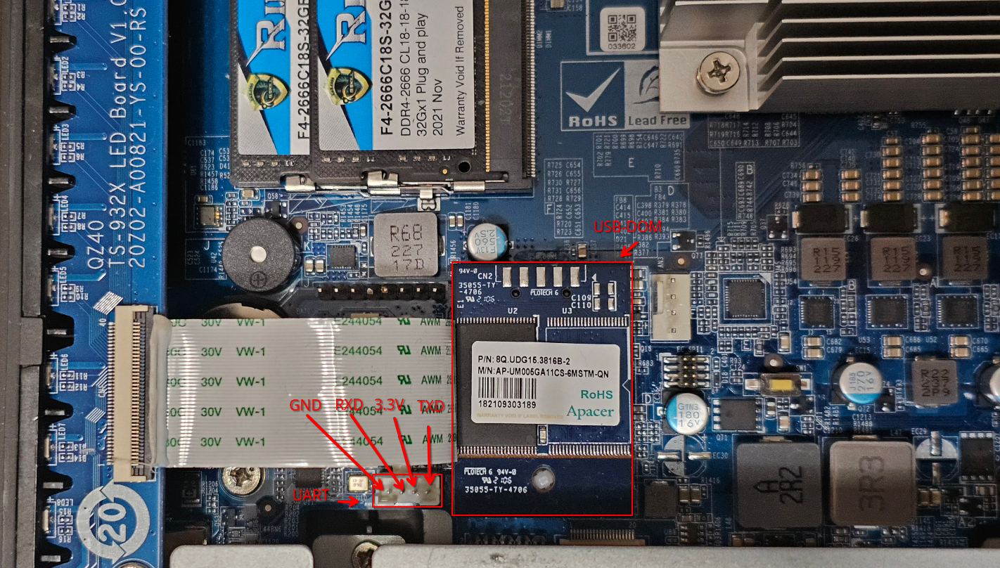
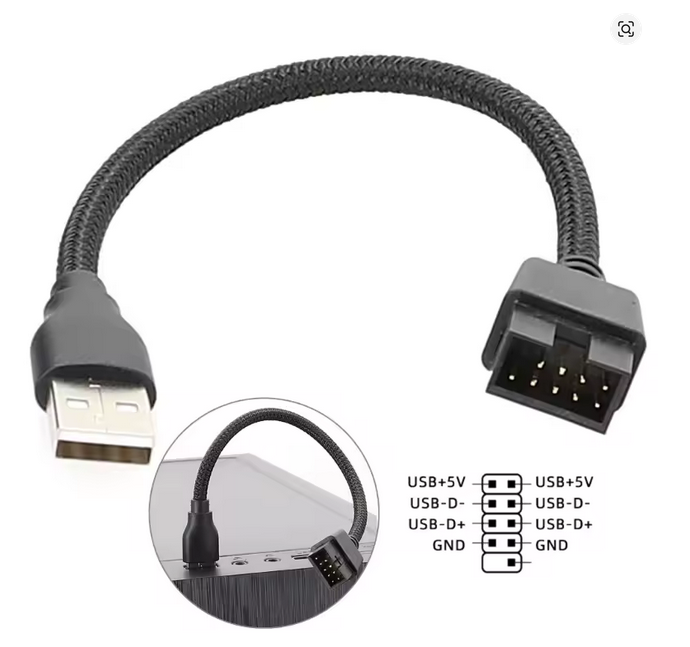
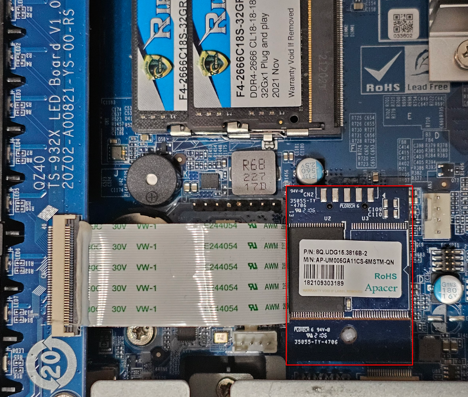
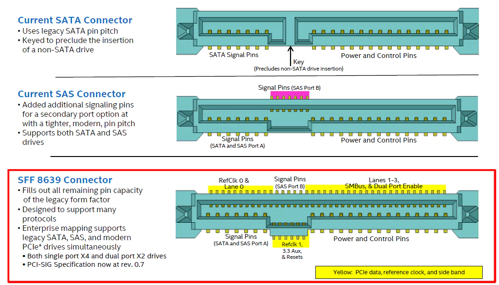
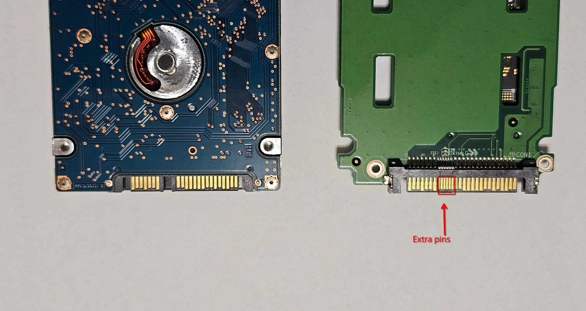
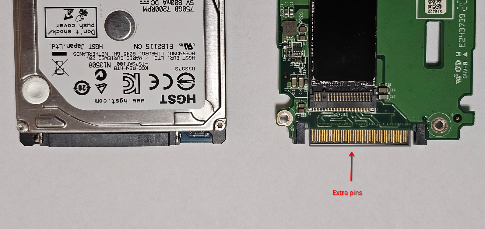

# Qnap TS-h973AX - NAS server from scratch (in progress)

- [Qnap TS-h973AX - NAS server from scratch (in progress)](#qnap-ts-h973ax---nas-server-from-scratch-in-progress)
  - [Board](#board)
    - [Specification](#specification)
    - [UART](#uart)
      - [Investigation](#investigation)
      - [Useful command](#useful-command)
    - [BIOS](#bios)
      - [Boot order](#boot-order)
  - [Arch installation](#arch-installation)
    - [Kernel parameters](#kernel-parameters)
    - [OS disk preparation](#os-disk-preparation)
      - [Checklist before partitioning](#checklist-before-partitioning)
      - [Partitions](#partitions)
        - [Encryption (root)](#encryption-root)
          - [Recovery password](#recovery-password)
          - [Binary key file](#binary-key-file)
          - [TPM \& TANG](#tpm--tang)
          - [Decrypt luks partition](#decrypt-luks-partition)
          - [Use dedicate AMD Encryption controller](#use-dedicate-amd-encryption-controller)
        - [Logical Volume Manager (LVM)](#logical-volume-manager-lvm)
        - [BTRFS file system](#btrfs-file-system)
      - [EFI preparing (/boot)](#efi-preparing-boot)
      - [Mount layout](#mount-layout)
    - [Basic settings, packages, users](#basic-settings-packages-users)
      - [System initialization](#system-initialization)
      - [Locale](#locale)
      - [Users and permission](#users-and-permission)
      - [Pacman configure](#pacman-configure)
      - [Install basic packages](#install-basic-packages)
      - [Service to enable](#service-to-enable)
      - [Install YAY](#install-yay)
      - [AUR packages](#aur-packages)
      - [Configure network](#configure-network)
      - [Initramfs image](#initramfs-image)
      - [UEFI boot manager](#uefi-boot-manager)
  - [After first boot](#after-first-boot)
    - [Other basic settings](#other-basic-settings)
      - [Resolver](#resolver)
      - [Propagation dotfile](#propagation-dotfile)
      - [Timezone and date](#timezone-and-date)
      - [Hostname](#hostname)
      - [Locale (again)](#locale-again)
    - [OS optimization](#os-optimization)
      - [Network](#network)
      - [RAM/IO (cache, inotify)](#ramio-cache-inotify)
      - [RAID](#raid)
    - [UART fix](#uart-fix)
      - [Agetty with UART](#agetty-with-uart)
  - [NAS Server](#nas-server)
    - [Disk Topology](#disk-topology)
      - [Partitions](#partitions-1)
        - [RAID6 - prepare disk](#raid6---prepare-disk)
        - [RAID1 - prepare disk](#raid1---prepare-disk)
        - [NVMe cache - prepare disk](#nvme-cache---prepare-disk)
    - [RAID via mdadm](#raid-via-mdadm)
      - [RAID6](#raid6)
      - [RAID1](#raid1)
      - [RAID configuration](#raid-configuration)
        - [Change the name](#change-the-name)
      - [RAID optimization](#raid-optimization)
      - [RAID Mail notification](#raid-mail-notification)
        - [Postfix](#postfix)
    - [dm-crypt](#dm-crypt)
    - [LVM](#lvm)
      - [Files (Media \& Private)](#files-media--private)
        - [Cache (Media \& Private)](#cache-media--private)
      - [ISCSI](#iscsi)
        - [Cache ISCSI](#cache-iscsi)
      - [Troubleshooting](#troubleshooting)
        - [vgcreate - `inconsistent logical block sizes`](#vgcreate---inconsistent-logical-block-sizes)
      - [dm-cache with SSD](#dm-cache-with-ssd)
    - [BTRFS - File system](#btrfs---file-system)
      - [Media](#media)
      - [Private](#private)
  - [Share files](#share-files)
    - [Samba](#samba)
    - [DLNA](#dlna)
    - [Snapshots - snapper](#snapshots---snapper)
  - [SSD TRIM](#ssd-trim)
  - [ISCSI](#iscsi-1)
  - [UPS](#ups)
  - [ACPI custom DSDT](#acpi-custom-dsdt)
  - [TODO](#todo)

## Board

### Specification

The QNAP [TS-h973AX](https://www.qnap.com/en/product/ts-h973ax) is a 9-bay NAS server in a compact tower design.

Specification:

- CPU - AMD Ryzen™ Embedded V1500B 2.2 GHz 2 (8 treads)
- RAM - max 64GB DDR4 SO-DIMM
- Drive Bays - 9 bays
  - 5 x 3.5" SATA 6 Gb/s
  - 2 x 2.5" SATA 6 Gb/s / U.2 NVMe PCIe Gen 3 x4
  - 2 x 2.5" SATA 6 Gb/s
  - 1x USB-DOM 4G internal contain [QuTS hero](https://www.qnap.com/en/operating-system/quts-hero) OS
- Network - 3 ports
  - 1x 10GBase
  - 2x 2.5GBase
- USB
  - 1x USB-C 3.2 Gen 2 10Gb/s back
  - 2x USB-A 3.2 Gen 2 back
  - 1x USB-A 3.2 Gen 2 front

### UART

The TS-h973AX does not have a graphics card, but is capable of displaying information like POST, boot log information via UART interface.

Diagram showing how to connect the UART adapter to the QNAP TS-h973AX board, with particular attention to the correct connections between TXD and RXD:

```bash
   QNAP BOARD                           UART ADAPTER (USB)
   -----------                          -------------------
    [TXD] o------------------------->o [RXD]
    [RXD] o<-------------------------o [TXD]
    [GND] o--------------------------o [GND]
```

UART port location on the motherboard



UART parameters:

- baudrate -> 115200
- databits -> 8
- stopbits -> 1
- parity -> none
- flowcontrol -> none

You can use any UART terminal, for example, `picocom`

```bash
picocom -b 115200 -f n /dev/ttyUSB0
```

#### Investigation

I've spent many hours trying to understand why `UART` works unstable and quickly hangs for never distribution like [Debian](https://www.debian.org), [Arch Linux](https://archlinux.org), [TrueNAS](https://www.truenas.com), but works stable during [POST messages](https://en.wikipedia.org/wiki/Power-on_self-test), [BIOS interaction](https://www.techtarget.com/whatis/definition/BIOS-basic-input-output-system) and **all the time** for [QuTS hero](https://www.qnap.com/en/operating-system/quts-hero).

- QuTS hero has an additional command in the [DSDT](https://wiki.archlinux.org/title/DSDT) table for ACPI that allows reconfiguring the UART (`UAR1`, `UAR2`) via an [ACPI calls](https://github.com/mkottman/acpi_call), but after trying to change the configuration it refused to turn on.

```bash
'\_SB.PCI0.UAR1._STA' - _STA: Port Status
'\_SB.PCI0.UAR1._CRS' - _CRS: Current Resource Settings
'\_SB.PCI0.SBRG.UAR1._DIS' - _DIS: Disable port
'\_SB.PCI0.SBRG.UAR1._SRS' - _SRS: Set Resource Settings
```

- In newer Linux distributions (with Kernel 6.X) which I tested on this board, the UART usually switched to [software flow control](https://en.wikipedia.org/wiki/Software_flow_control) mode automatically. Currently, I am forcing flow control to be disabled via kernel parameters, which makes the UART more stable. This is one-way communication (only receiving logs from Linux)

- After Linux boots, with dedicated [Kernel parameters](#kernel-parameters), the **bidirectional UART communication** is still a big problem. It doesn't matter if software flow control is used; the UART will quickly hang after interaction, when port is freezing, there is not possible to communicate with it, change settings, or even send echo to port `echo "test" > /dev/ttyS0`.

  There is a trick to unfreeze the port for a few seconds, just call this command  `cat /proc/tty/driver/serial`

  ```bash
  $ cat /proc/tty/driver/serial
    
  serinfo:1.0 driver revision:
  0: uart:16550A port:000003F8 irq:4 tx:15316 rx:417 RTS|DTR
  1: uart:16550A port:000002F8 irq:3 tx:0 rx:0
  ```

  For now, I discovered that switching the port from [IRQ](https://en.wikipedia.org/wiki/Interrupt_request) to [polling mode](https://en.wikipedia.org/wiki/Polling_(computer_science)) makes the UART stable for bidirectional communication, the disadvantage of polling mode is that the port slows down, but at least it is working.

  ```bash
  $ cat /proc/tty/driver/serial
  
  serinfo:1.0 driver revision:
  0: uart:16550A port:000003F8 irq:0 tx:16210 rx:465 RTS|DTR
  1: uart:16550A port:000002F8 irq:3 tx:0 rx:0
  ```

> [!NOTE]
> In section [UART fix](#uart-fix) is explained how to make polling mode permanent for each boot (`IRQ 4` -> `IRQ 0`)

#### Useful command

- `cat /proc/tty/driver/serial` - UART status with flags/registry
- `fuser -v /dev/ttyS0` - shows which process is hanging/using the port, kill all processes with `-k`
- `echo on | sudo tee /sys/class/tty/ttyS0/device/power/control` - disable automatic power suspension
- `/sbin/setserial /dev/ttyS0 uart 16550A port 0x3f8 irq 0` - port using polling
- `/sbin/setserial /dev/ttyS0 uart 16550A port 0x3f8 irq 4` - port using IRQ
- `udevadm info -a -n /dev/ttyS0 | grep -E 'DRIVER|DEVPATH|SUBSYSTEM` - information about driver hierarchy under udev
- `stty -F /dev/ttyS0 -a` - UART configuration
- `lspci -k` - basic information about devices and drivers/modules

> [!NOTE]
> `setserial` can be installed from [AUR](https://aur.archlinux.org/packages/setserial)

### BIOS

It was mentioned that the UART works stably during POST messages and BIOS interaction, pressing `DEL` during POST allows you to enter BIOS

```bash
Version 2.20.1274. Copyright (C) 2021 American Megatrends, Inc.                 
BIOS Date: 07/21/2021 18:24:22 Ver: Q071AR10                                    
Press <DEL> or <ESC> to enter setup.
```

Useful BIOS settings:

- turn off the `BIOS Beep Function` - no more noise beep
- adapt the `Restore AC Power Loss` - this also can be changed from [QuTS hero](https://www.qnap.com/en/operating-system/quts-hero)
- update `Boot Option Priorities` - configure your own boot order

```bash
                 Aptio Setup Utility - Copyright (C) 2021 American Megatrends, Inc.                 
    Main  Advanced  Chipset  Security  Boot  Save & Exit                                            
+-----------------------------------------------------------------+--------------------------------+
|  Boot Configuration                                             |Select the keyboard NumLock     |
|  Bootup NumLock State                 [On]                      |state                           |
|  Quiet Boot                           [Disabled]                |                                |
|                                                                 |                                |
|  Boot Option Priorities                                         |                                |
|  Boot Option #1                       [UEFI OS (KINGSTON        |                                |
|                                       SNV3S500G)]               |                                |
|  Boot Option #2                       [KINGSTON SNV3S500G]      |                                |
|  Boot Option #3                       [UEFI: Built-in EFI       |                                |
|                                       Shell]                    |                                |
|                                                                 |                                |
|                                                                 |                                |
|                                                                 +--------------------------------+
|                                                                 |><: Select Screen               |
|                                                                 |space: Select Item              |
|                                                                 |Enter: Select                   |
|                                                                 |+/-: Change Opt.                |
|                                                                 |F1: General Help                |
|                                                                 |F2: Previous Values             |
|                                                                 |F3: Optimized Defaults          |
|                                                                 |F4: Save & Exit                 |
|                                                                 |ESC: Exit                       |
|                                                                 |                                |
|                                                                 |                                |
|                                                                 |                                |
|                                                                 |                                |
+-----------------------------------------------------------------+--------------------------------+
                  Version 2.20.1274. Copyright (C) 2021 American Megatrends, Inc.     
```

#### Boot order

> [!IMPORTANT]
> This BIOS v2.20.1274 allowing to boot only from [USB device](https://en.wikipedia.org/wiki/USB) or [NVMe disk](https://en.wikipedia.org/wiki/NVM_Express).  
> [SATA disk](https://en.wikipedia.org/wiki/SATA) are not available in a `BOOT Option`.

There are two possibilities to make the boot work:

1. Use internal USB-DOM as an [EFI partition](https://en.wikipedia.org/wiki/EFI_system_partition), which will allow booting the operating system from the SATA drive.

   ```bash
   +-----------+      +-------------------------------+
   |           |      |                               |
   |  EFI      |      |        Root partition         |
   | Partition |      |                               |
   |           |      |                               |
   +-----------+      +-------------------------------+
   |  USB DOM  |      |            HDD                |
   |   (EFI)   |      |         (OS DATA)             |
   +-----------+      +-------------------------------+
   ```

   - **USB DOM** - Small USB device used to keep the EFI partition
   - **HDD** - SATA disk used for the operating system

   This configuration does not require any interaction with the `BOOT Option`, because the USB-DOM can be connected to another computer and prepared accordingly, and QNAP board will still try to read the EFI partitions from the USB-DOM.

   I used such adapter

   

   Remember to make a copy of the USB-DOM memory. Command `dd if=/dev/sda of=./qnap.img`

2. The TS-h973AX motherboard has two SATA/U.2 bay slots, which allow to use of the [QNAP U.2 NVMe adapter](https://eustore.qnap.com/qda-ump4.html) with an NVMe drive. Such an adapter gives the possibility to use NVMe at full speed and make it available as a boot option.

   This configuration requires interaction with the `BOOT Option`, and using an NVMe drive as a boot drive, but the speed gain is significant.

   ```bash
   +-------------------------------+
   |           |                   |
   |   EFI     |      Linus OS     |
   | Partition |                   |
   |           |                   |
   +-------------------------------+
   |           NVMe SSD            |
   |            1 disk             |
   +-----------+-------------------+
   ```

   **NVMe SSD**: Single NVMe disk for both `EFI` and `root`

> [!IMPORTANT]
> A standard NVMe-to-SATA adapter won't detect this drive as NVMe because it only uses the SATA interface for data transfer. Use a U.2 NVMe adapter with an SFF-8639 connector. To learn more about the QNAP adapter's design, see the images below.
>
>   
>   
>   

## Arch installation

[Arch Linux Live distributions](https://wiki.archlinux.org/title/USB_flash_installation_medium) always boot with an SSH server already running. Simply setting a root password will allow you to successfully log in to the Arch Live distribution via SSH. The tricky part is that you need to set a `root` password without being able to see what you are doing, so wait a few minutes for the boot process to finish and then enter the command below (with a keyboard connected to the QNAP, of course).

```bash
passwd root
```

Repeat the password twice.

> [!TIP]
> I recommend understanding the entire flow because you have to execute these commands from memory
>
> ```bash
> passwd root
> New password: 
> Retype new password:
> passwd: password updated successfully
> ```

after that, you can use SSH to log in to Arch Live distribution (this IP `192.168.1.123` is just an example; you need to figure out the IP of Arch Live distribution)

```bash
ssh root@192.168.1.123
```

> [!NOTE]
> This installation process is just an extension of the excellent [Arch Installation Guide](<https://wiki.archlinux.org/title/Installation_guide>), which I recommend.

### Kernel parameters

The following kernel parameters stabilize the UART **ONLY** when receiving logs (one-way communication), which allows you to observe the entire boot process.**The order of the parameters is important.**

Optimized, which working well

```bash
console=ttyS0,115200n8 \
  console=tty0 \
  loglevel=6 \
  8250.nr_uarts=2 \
  8250.skip_txen_test=1
```

For debug purpose, useful for other Linux distribution

```diff
+earlycon=uart8250,io,0x3f8,115200 \
  console=ttyS0,115200n8 \
  console=tty0 \
  loglevel=6 \
+ no_console_suspend \
  8250.nr_uarts=2 \
+ 8250.share_irqs=1 \
  8250.skip_txen_test=1
```

- `earlycon=uart8250,io,0x3f8,115200` - enables an early console on a legacy 8250 UART at I/O port `0x3f8`, `115200 bps`. This prints very-early kernel messages before the full TTY/driver stack is up. It’s simple, polled I/O—no interrupts, no [termios](https://en.wikibooks.org/wiki/Serial_Programming/termios), no flow control—meant purely for early boot logs.

- `console=ttyS0,115200n8` - adds a regular kernel console on `/dev/ttyS0` at `115200`, `8 data bits`, `no parity`, `1 stop bit`
  - Adding `r` to the end -> `ttyS0,115200n8` is enabling hardware [RTS/CTS](https://en.wikipedia.org/wiki/RS-232#RTS,_CTS,_and_RTR)  
  - [XON/XOFF](https://en.wikipedia.org/wiki/Software_flow_control) belongs to termios/user space, not the kernel console

- `console=tty0` - adds a console to the current virtual terminal (VGA). The last `console=` wins in the case of a `/dev/console` connection and becomes **primary**. This is a workaround for an unstable UART, which, if made primary, can freeze the entire boot process.

- `loglevel=6` - sets the console logging level to `INFO` (range is 0=emerg -> 7=debug).

- `8250.nr_uarts=2` - limit the driver to register at most 2 UART, this reduces probing/registration to a single port.

- `8250.share_irqs=1` - allow the 8250 driver to share IRQs with other devices.

- `8250.skip_txen_test=1` - it skips the “TX enable” sanity test used for some quirky UARTs during init.

### OS disk preparation

Partitioning depends on the approach you choose, with or without a USB DOM (check [Boot Order](#boot-order) for more information). This guide uses a single NVMe drive for the entire system (without a USB DOM) with encryption, LVM and BTRFS as file system.

```bash
+-----------------+-------------------+
|                 |                   |
|  EFI Partition  |  Root partition   |
|     (VFAT)      |     (BTRFS)       |
|                 |                   |
|                 +-------------------+
|                 |                   |
|                 |       LVM         |
|                 |                   |
|                 +-------------------+
|                 |                   |
|                 |    cryptsetup     |
|                 |                   |
+-----------------+-------------------+
|               NVMe SSD              |
|                1 disk               |
+-------------------------------------+
```

#### Checklist before partitioning

Typically, NVMe drives use a smaller block size of `512B`, which is slower than `4096B`.

> [!WARNING]
>
> Changing the block size will result in the loss of all data and partitions on the disk.

Install `nvme-cli` from [aur](https://aur.archlinux.org/packages/nvme-cli-git), and after that, you can check the supported block sizes:

```bash
$ nvme id-ns /dev/nvme1n1 -H | grep -e "^LBA Format"

LBA Format  0 : Metadata Size: 0   bytes - Data Size: 512 bytes - Relative Performance: 0x2 Good (in use)
LBA Format  1 : Metadata Size: 0   bytes - Data Size: 4096 bytes - Relative Performance: 0x1 Better
```

`512 bytes` is in use, let's change the LBA format to `4096 bytes` -> `1`

```bash
nvme format /dev/nvme0n1 -l 1 --force
```

Validate change, if `4096 bytes` is in use

```bash
$ nvme id-ns /dev/nvme1n1 -H | grep -e "^LBA Format"

LBA Format  0 : Metadata Size: 0   bytes - Data Size: 512 bytes - Relative Performance: 0x2 Good 
LBA Format  1 : Metadata Size: 0   bytes - Data Size: 4096 bytes - Relative Performance: 0x1 Better (in use)
```

#### Partitions

Required disk configuration:

- Disk partition table need to use `GPT`
- EFI parition needs to use correct type `EFI System`
- OS parition should be `Linux filesystem`

```bash
$ fdisk /dev/nvme0n1 -l

Disk /dev/nvme0n1: 465.76 GiB, 500107862016 bytes, 976773168 sectors
Disk model: KINGSTON SNV3S500G                      
Units: sectors of 1 * 512 = 512 bytes
Sector size (logical/physical): 512 bytes / 512 bytes
I/O size (minimum/optimal): 512 bytes / 512 bytes
Disklabel type: gpt
Disk identifier: 5A741586-4E80-4CEF-A117-C69E2850E569

Device           Start       End   Sectors   Size Type
/dev/nvme0n1p1    2048   2099199   2097152     1G EFI System
/dev/nvme0n1p2 2099200 976773119 974673920 464.8G Linux filesystem
```

##### Encryption (root)

I realize that entering a password every time the NAS server boots can be inconvenient, even though the TS-h973AX board doesn't have a video card can be more difficult, but an unencrypted root partition where RAID passwords are stored also poses a serious security risk.

After trying different methods and taking into account the limitations (no graphics card), I decided to use [TPM](https://wiki.archlinux.org/title/Trusted_Platform_Module) + [TANG](https://github.com/latchset/tang) as a required condition to automatically unlock the encrypted root partition.

> [!TIP]
> How to configure a [TANG server](https://man.archlinux.org/man/tang.8.en). It is important to understand how it works and how to restore the `jwk` files required for disaster recovery. Back up your `jwk` files !!!

Required packages

```bash
pacman -S clevis jose tpm2-tools
```

Encryption performance depends on the hardware features supported, so a benchmark is important. [check this guide](https://wiki.archlinux.org/title/Dm-crypt/Device_encryption)

```bash
cryptsetup benchmark 

# Tests are approximate using memory only (no storage IO).
PBKDF2-sha1      1072163 iterations per second for 256-bit key
PBKDF2-sha256    2076388 iterations per second for 256-bit key
PBKDF2-sha512     688946 iterations per second for 256-bit key
PBKDF2-ripemd160  386643 iterations per second for 256-bit key
PBKDF2-whirlpool  274784 iterations per second for 256-bit key
argon2i       4 iterations, 924844 memory, 4 parallel threads (CPUs) for 256-bit key (requested 2000 ms time)
argon2id      4 iterations, 927845 memory, 4 parallel threads (CPUs) for 256-bit key (requested 2000 ms time)
#     Algorithm |       Key |      Encryption |      Decryption
        aes-cbc        128b       446.3 MiB/s       898.6 MiB/s
    serpent-cbc        128b        46.7 MiB/s       157.0 MiB/s
    twofish-cbc        128b        88.4 MiB/s       159.4 MiB/s
        aes-cbc        256b       349.6 MiB/s       853.7 MiB/s
    serpent-cbc        256b        46.7 MiB/s       157.0 MiB/s
    twofish-cbc        256b        88.4 MiB/s       159.4 MiB/s
        aes-xts        256b      1054.6 MiB/s      1054.1 MiB/s
    serpent-xts        256b       145.4 MiB/s       145.5 MiB/s
    twofish-xts        256b       148.0 MiB/s       147.7 MiB/s
        aes-xts        512b       951.1 MiB/s       950.5 MiB/s
    serpent-xts        512b       145.4 MiB/s       145.5 MiB/s
    twofish-xts        512b       144.4 MiB/s       147.6 MiB/s
```

###### Recovery password

During encryption, `cryptsetup` asks for a static password. Create a strong password, as this will be the recovery password. This password will be stored in slot `0`.

```bash
cryptsetup luksFormat /dev/nvme0n1p2 -c aes-xts-plain64 -s 256 -h sha512
```

###### Binary key file

A binary key file is one option for unlocking a partition. I recommend using it as a backup on a USB drive. It can be helpful when you need to decrypt the main partition when the TPM + TANG method doesn't work.

Generate a binary key file, which can be stored on USB drive or NFS endpoint

```bash
dd bs=512 count=4 if=/dev/random iflag=fullblock | install -m 0600 /dev/stdin ./root.key
```

Add key file to Luks on slot `1`

```bash
cryptsetup luksAddKey /dev/nvme0n1p2 -S 1 root.key -h sha512
```

> [!TIP]
> Read this guide, about the [binary key file](https://wiki.archlinux.org/title/Dm-crypt/System_configuration#rd.luks.key)

Add following kernel parameter

- `rd.luks.key=XXXXXXXX=/path/to/keyfile:UUID=ZZZZZZZZ`, where `XXXXXXXX` is the UUID encrypted partition and `ZZZZZZZZ` is the UUID of partition where key is located.

- `rd.luks.options=XXXXXXXX=keyfile-timeout=10s`- without this options, Kernel will wait forever for binary key.

Instead of adding another kernel parameter, there is possibility to add this settings to `/etc/crypttab.initramfs` which during recreating of initramfs `mkinitcpio -P` will be included to initramfs-linux.img.

```conf
# /etc/crypttab.initramfs

luks_root    UUID=XXXXXXXX-XXXX-XXXX-XXXX-XXXXXXXXXXXX   /root.key:UUID=ZZZZZZZZ-ZZZZ-ZZZZ-ZZZZ-ZZZZZZZZZZZZ   luks,keyfile-timeout=10s
```

###### TPM & TANG

Validate if TPM is working, in case of issue check this [guide](https://wiki.archlinux.org/title/Trusted_Platform_Module)

```bash
tpm2_pcrread sha256:7
  sha256:
    7 : 0x46R2AO92OXMV4QMJJNDXITEP33BR3FZXGVU01VC0B6XY8LIGEC51K8M00SCJ4DCJM
```

Check if TANG is accessible, in this scenario TANG server is exposed on `7500` port

```bash
curl http://tang.example.com:7500/adv
```

Read how the `clevis` condition [works](https://github.com/latchset/clevis?tab=readme-ov-file#pin-shamir-secret-sharing)

```bash
clevis luks bind -d /dev/nvme0n1p2 sss \
  '{"t":2,"pins":{
      "tpm2":{"pcr_ids":"7"},
      "tang":{"url":"http://tang.example.com:7500"}
    }}'
```

Validate if new key was added

```bash
cryptsetup luksDump /dev/nvme0n1p2 
```

```diff
...
+Keyslots:
+  2: luks2
+       Key:        256 bits
+       Priority:   normal
+       Cipher:     aes-xts-plain64
+       Cipher key: 256 bits
+       PBKDF:      pbkdf2
+       Hash:       sha256
+       Iterations: 1000
...
Tokens:
  0: systemd-recovery
        Keyslot:    0
+ 1: clevis
+       Keyslot:    2
...
```

###### Decrypt luks partition

It's required to progress with the next steps, like LVM, BTRFS, etc.

```bash
cryptsetup open /dev/nvme0n1p2 luks_root
 ```

###### Use dedicate AMD Encryption controller

AMD Encryption controller is detect  but Kernel report some issue.

```bash
10:00.2 Encryption controller: Advanced Micro Devices, Inc. [AMD] Raven/Raven2/FireFlight/Renoir/Cezanne Platform Security Processor
```

```bash
ccp 0000:10:00.2: ccp enabled
ccp 0000:10:00.2: psp: unable to access the device: you might be running a broken BIOS.
```

> [!CAUTION]
> Require investigation

##### Logical Volume Manager (LVM)

> [!TIP]
> Read this [guide](https://wiki.archlinux.org/title/Dm-crypt/Encrypting_an_entire_system) about LVM to understand all the following command and their consequences.

```bash
pvcreate /dev/mapper/luks_root
```

```bash
vgcreate vg_root /dev/mapper/luks_root
```

```bash
lvcreate -L 250G vg_root -n lv_root
```

##### BTRFS file system

> [!TIP]
> Read this [guide](https://wiki.archlinux.org/title/Btrfs) about BTRFS to understand all the following command and their consequences.

In this configuration, subvolumes will be used for the following endpoints:

- `@` - `/` (root)
- `@home` - `/home`
- `@var_cache` - `/var/cache`

Format partition with `root` label

```bash
mkfs.btrfs -L root /dev/vg_root/lv_root
```

Mount the partition to create subvolumes

```bash
mount /dev/vg_root/lv_root /mnt
```

Create subvolume

```bash
btrfs subvolume create /mnt/@
btrfs subvolume create /mnt/@home
btrfs subvolume create /mnt/@var_cache
```

List all subvolumes

```bash
$ btrfs subvolume list -p /mnt

ID 256 gen 10 parent 5 top level 5 path @
ID 257 gen 10 parent 5 top level 5 path @home
ID 259 gen 11 parent 5 top level 5 path @var_cache
```

Make subvolume `@` as default

```bash
btrfs subvolume set-default 256 /mnt
```

Check default subvolume

```bash
btrfs subvolume get-default /mnt
```

#### EFI preparing (/boot)

TODO: Add description

```bash
mkfs.vfat -F 32 /dev/nvme0n1p1
```

#### Mount layout

Make following folders

```bash
mkdir /mnt/home 

mkdir -p /mnt/var/cache

mkdir /mnt/boot         

```

> [!IMPORTANT]
> Umount root partition, to use subvolumes
>
> ```bash
> umount /mnt
> ```

> [!TIP]
> Read this [doc](https://btrfs.readthedocs.io/en/latest/ch-mount-options.html), to understand BTRFS mount options.

```bash
mount -o subvol=@,relatime,lazytime,autodefrag /dev/vg_root/lv_root /mnt

mount -o subvol=@home,relatime,lazytime,autodefrag /dev/vg_root/lv_root /mnt/home

mount -o subvol=@var_cache,compress=zstd:3,relatime,lazytime /dev/vg_root/lv_root /mnt/var/cache

mount /dev/nvme0n1p1 /mnt/boot
```

### Basic settings, packages, users

#### System initialization

Requires all system partitions to be properly mounted on `/mnt`, check the visualization of the mount point layout

Check mount layout

```bash
$ lsblk

nvme0n1               259:0    0 465.8G  0 disk  
├─nvme0n1p1           259:1    0     1G  0 part  /mnt/boot
└─nvme0n1p2           259:2    0 464.8G  0 part  
  └─luks_root         253:0    0 464.7G  0 crypt 
    └─vg_root-lv_root 253:1    0   250G  0 lvm   /mnt/var/cache
                                                 /mnt/home
                                                 /mnt
```

```bash
pacstrap /mnt amd-ucode base base-devel bash-completion \
  linux linux-headers linux-firmware openssh vim btrfs-progs
```

During creation of initramfs, may occur some problems, all will be fixed in later steps

```bash
==> Building image from preset: /etc/mkinitcpio.d/linux.preset: 'default'
==> Using default configuration file: '/etc/mkinitcpio.conf'
  -> -k /boot/vmlinuz-linux -g /boot/initramfs-linux.img
==> Starting build: '6.17.8-arch1-1'
  -> Running build hook: [base]
  -> Running build hook: [systemd]
  -> Running build hook: [autodetect]
  -> Running build hook: [microcode]
  -> Running build hook: [modconf]
  -> Running build hook: [kms]
  -> Running build hook: [keyboard]
  -> Running build hook: [keymap]
  -> Running build hook: [sd-vconsole]
==> ERROR: file not found: '/etc/vconsole.conf'
  -> Running build hook: [block]
  -> Running build hook: [filesystems]
  -> Running build hook: [fsck]
==> Generating module dependencies
==> Creating zstd-compressed initcpio image: '/boot/initramfs-linux.img'
==> WARNING: errors were encountered during the build. The image may not be complete.
error: command failed to execute correctly
```

Remember to generate `fstab`

```bash
genfstab -U -p /mnt > /mnt/etc/fstab
```

[Chroot](https://en.wikipedia.org/wiki/Chroot) to new OS

```bash
arch-chroot /mnt
```

#### Locale

Set locale

```bash
echo "en_US.UTF-8 UTF-8" >  /etc/locale.gen
echo "pl_PL.UTF-8 UTF-8" >> /etc/locale.gen

locale-gen
```

```bash
localectl set-keymap pl2
```

> [!NOTE]
> command `localectl set-keymap pl2` need to be repeat after first boot,
> because now `/etc/vconsole.conf` is required to generate a correct `initramfs-linux.img`
> but `localectl` not fully working in a `chroot`

```bash
echo "KEYMAP=pl2" > /etc/vconsole.conf
```

#### Users and permission

Set root password

```bash
passwd root
```

Create user

```bash
useradd -g users -G wheel,lock -m -s /bin/bash my_user
passwd my_user
```

Modify `/etc/sudoers` via `visudo` command

```diff
...
 ## Uncomment to allow members of group wheel to execute any command
-# %wheel ALL=(ALL:ALL) ALL
+%wheel ALL=(ALL:ALL) ALL
...
```

#### Pacman configure

```diff
...
-#Color
+Color
...
-#[multilib]
-#Include = /etc/pacman.d/mirrorlist
+[multilib]
+Include = /etc/pacman.d/mirrorlist
...
```

#### Install basic packages

```bash
pacman -Syy && \
pacman -S acpi \
  acpi_call \
  acpid \
  clevis \
  dmidecode \
  git \
  go \
  htop \
  iotop \
  lm_sensors \
  lsof \
  lvm2 \
  mdadm \
  minidlna \
  nvme-cli \
  samba \
  smartmontools \
  snapper \
  strace \
  sysstat \
  systemd-resolvconf \
  tpm2-tools \
  zsh \
  zsh-autosuggestions \
  zsh-history-substring-search \
  zsh-syntax-highlighting
```

> [!TIP]
> `acpi_call` should be replaced with  `acpi_call-dkms` if used LTS or different Kernel images

#### Service to enable

```bash
systemctl enable acpid
systemctl enable sshd
systemctl enable systemd-networkd
systemctl enable systemd-resolved
```

#### Install YAY

Remember to to switch to regular user `my_user`

```bash
git clone https://aur.archlinux.org/yay.git
cd yay
makepkg -si
```

#### AUR packages

```bash
yay -S fzf-marks \
  mkinitcpio-systemd-extras \
  # mkinitcpio-systemd-root-password \
  setserial \
  ttf-meslo-nerd-font-powerlevel10k \
  zsh-theme-powerlevel10k-git
```

TODO: validate mkinitcpio-systemd-root-password

#### Configure network

> [!TIP]
> Read this [guide](https://www.freedesktop.org/software/systemd/man/latest/systemd.network.html) about network configuration via `systemd-networkd`.

```conf
# /etc/systemd/network/10-nic.network 

# Enable DHCPv4 on all physical ethernet links
[Match]
Kind=!*
Type=ether

[Network]
DHCP=ipv4
LLDP=true
EmitLLDP=yes

[DHCPv4]
ClientIdentifier=mac
UseNTP=true
```

#### Initramfs image

Package `mkinitcpio-systemd-extras` will delivery all necessary hooks [sd-clevis](https://github.com/wolegis/mkinitcpio-systemd-extras/wiki/Clevis), [sd-network](https://github.com/wolegis/mkinitcpio-systemd-extras/wiki/Networking), [sd-resolve](https://github.com/wolegis/mkinitcpio-systemd-extras/wiki/Name-Resolution) require auto-unlock root partition via network, please read documentation careful.

Modules:

`atlantic` - driver for 10G ethernet
`igc` - driver for 2.5G ethernet
`vfat` - driver to access `boot` partition during boot

```conf
# /etc/mkinitcpio.conf

...
MODULES=(atlantic igc ethernet)
...

HOOKS=(base systemd btrfs autodetect microcode modconf kms keyboard sd-vconsole block mdadm_udev sd-network sd-resolve block sd-clevis sd-encrypt lvm2 filesystems fsck)
```

- `btrfs` - adding all BTRFS modules, which can be helpful to fix root partition
- `mdadm_udev` - provide support for assembling RAID arrays via udev
- `sd-network` - adding support for network
- `sd-resolve` - adding support for resolving DNS names
- `sd-clevis` - adding support for clevis
- `lvm2` - Adds the device mapper kernel module and the lvm tool to the image.

> [!CAUTION]
> `sd-resolve` require to create `/etc/hostname` -> `echo "qnap" > /etc/hostname`
>
> Remember to recreate initramfs `mkinitcpio -p linux`

#### UEFI boot manager

Executing the command below will copy the necessary files/directories to `/boot`

```bash
bootctl install
```

then create an entry for boot with UART support, remember to update the `root` UUID (use `blkid` or `lsblk -f`)

```conf
# /boot/loader/entries/arch.conf

title Arch
linux /vmlinuz-linux
initrd /initramfs-linux.img
initrd /amd-ucode.img
options options rd.neednet=1 rd.luks.uuid=7f0cc063-e383-4244-b4cb-12e6c396947f root=UUID=e0ff3e81-a516-4dbf-8103-8503655db764 rw mitigations=off audit=auto console=ttyS0,115200n8 console=tty0 loglevel=6 8250.nr_uarts=2 8250.skip_txen_test=1  
```

> [!WARNING]
> you should be ready to reboot Qnap server,

## After first boot

### Other basic settings

#### Resolver

Check if `resolv.conf` is a symnlink

```bash
ls -la /etc/resolv.conf 
lrwxrwxrwx 1 root root 37 Nov 24 09:33 /etc/resolv.conf -> /run/systemd/resolve/stub-resolv.conf
```

if not, fix it with the following command

```bash
ln -sf /run/systemd/resolve/stub-resolv.conf /etc/resolv.conf
```

```conf
#  /etc/systemd/resolved.conf

[Resolve]

FallbackDNS=1.1.1.1
MulticastDNS=yes
LLMNR=yes
Cache=no-negative
ReadEtcHosts=yes
StaleRetentionSec=0
```

```bash
systemctl restart systemd-resolved
```

#### Propagation dotfile

To propagate file configuration for each new user, add file to `/etc/skel`

```bash
cp .vimrc /etc/skel
```

```bash
cp .zshrc /etc/skel
```

Copy file to existing user

```bash
cp /etc/shel/* /home/my_user
```

#### Timezone and date

```bash
timedatectl set-timezone Europe/Warsaw
```

```bash
timedatectl set-ntp true
```

Validate

```bash
$ timedatectl timesync-status 


       Server: 89.250.197.242 (89.250.197.242)
Poll interval: 1min 4s (min: 32s; max 34min 8s)
         Leap: normal
      Version: 4
      Stratum: 4
    Reference: A29FC87B
    Precision: 1us (-20)
Root distance: 69.884ms (max: 5s)
       Offset: +3.568ms
        Delay: 568us
       Jitter: 1.348ms
 Packet count: 2
    Frequency: +0.000ppm
```

#### Hostname

```bash
hostnamectl hostname qnap
```

#### Locale (again)

Executing this command one again, will recreate `/etc/vconsole.conf` file

```bash
localectl set-keymap pl2
```

```conf
# /etc/vconsole.conf

KEYMAP=pl2
XKBLAYOUT=pl
XKBMODEL=pc105
XKBOPTIONS=terminate:ctrl_alt_bksp
```

### OS optimization

#### Network

```conf
# /etc/sysctl.d/99-nas-net.conf

net.core.rmem_max = 134217728
net.core.wmem_max = 134217728
net.core.netdev_max_backlog = 32768
net.ipv4.tcp_rmem = 4096 1048576 67108864
net.ipv4.tcp_wmem = 4096 1048576 67108864
net.core.default_qdisc = fq
net.ipv4.tcp_congestion_control = bbr
```

- `net.core.rmem_max = 134217728` (128 MiB)

   The hard upper limit for any socket’s receive buffer (all protocols, not just TCP). TCP’s auto-tuning won’t grow a socket above this cap.

- `net.core.wmem_max = 134217728` (128 MiB)

   The hard upper limit for any socket’s send buffer. TCP auto-tuning and apps can’t exceed this.

- `net.core.netdev_max_backlog` = 32768

   Max number of packets the kernel can queue per CPU on an interface’s ingress backlog when it can’t process them fast enough. If this fills up, packets are dropped before they reach sockets. A higher value helps absorb bursts on fast NICs.

- `net.ipv4.tcp_rmem` = 4096 1048576 67108864 (4 KiB, 1 MiB, 64 MiB)

  Per-TCP-socket receive buffer auto-tuning triplet: min / default (initial) / max in bytes.
  - The kernel starts near 1 MiB and can grow up to 64 MiB if the flow needs it (but never beyond rmem_max).
  - Larger max helps high-throughput, high-latency (“long fat”) links.

- `net.ipv4.tcp_wmem` = 4096 1048576 67108864 (4 KiB, 1 MiB, 64 MiB)

  Per-TCP-socket send buffer auto-tuning triplet: min / default / max in bytes.
  - The kernel starts near 1 MiB and can grow up to 64 MiB (but never beyond wmem_max).
  - Bigger max can improve single-flow throughput on high-bandwidth, higher-RTT paths.

- `net.core.default_qdisc` = fq

  Sets the default egress queuing discipline to FQ (Fair Queue). It creates per-flow queues and supports pacing, reducing head-of-line blocking and helping latency. It’s a good companion for modern congestion control like BBR. (Note: fq ≠ fq_codel; fq_codel also fights bufferbloat but in a different way.)

- `net.ipv4.tcp_congestion_control` = bbr

  Makes BBR the default TCP congestion control. BBR estimates bottleneck bandwidth and RTT to send at the path’s BDP, usually giving high throughput with low queueing delay. It works best with a pacing qdisc such as fq.

#### RAM/IO (cache, inotify)

```conf
# /etc/sysctl.d/99-nas-tuning.conf 

vm.dirty_background_bytes = 1073741824
vm.dirty_bytes            = 4294967296
vm.vfs_cache_pressure     = 50
fs.inotify.max_user_watches = 1048576
```

- `vm.dirty_background_bytes` = 1073741824 (1 GiB)

  When the total amount of dirty (not-yet-written) page cache in RAM exceeds 1 GiB, the kernel’s flusher threads start writing it to disk in the background. This is a start writing threshold, not a cap.

- `vm.dirty_bytes` = 4294967296 (4 GiB)

  A hard ceiling for dirty page cache. When total dirty data reaches 4 GiB, tasks that keep writing are throttled (they’ll synchronously write/slow down) until writeback clears space.
  - Because you’re using the *_bytes knobs, the percentage-based knobs (vm.dirty_ratio, vm.dirty_background_ratio) are ignored.
  - Rule of thumb: set dirty_background_bytes well below dirty_bytes (you did: 1 GiB < 4 GiB) so background writeback kicks in before writers hit the hard cap.

- `vm.vfs_cache_pressure` = 50

  Controls how aggressively the kernel reclaims the VFS inode/dentry caches versus page cache.
  - 100 is the neutral/default behavior.
  - 50 makes the kernel less aggressive about dropping inode/dentry caches, so it tends to keep filesystem metadata around longer. That can speed up path lookups and stat()-heavy workloads, at the cost of slightly less RAM available for file data cache and other uses.

- `fs.inotify.max_user_watches` = 1048576 (≈1.05 million)

  Maximum number of inotify watches per user. Higher limits are useful for tools like IDEs, file sync/backup daemons, or build systems that watch many directories.
  - Each watch consumes kernel memory (order of hundreds of bytes to ~1 KiB depending on kernel/build), so 1 M watches can mean hundreds of MiB of RAM reserved in the worst case. Make sure your system has headroom.

#### RAID

```conf
# /etc/sysctl.d/99-md-raid.conf

dev.raid.speed_limit_min = 50000
dev.raid.speed_limit_max = 800000
```

- `dev.raid.speed_limit_min` = 50000 (≈ 50,000 KiB/s ≈ 49 MiB/s ≈ 50 MB/s)

  A soft floor for MD RAID background operations (resync, rebuild/recovery, reshape, consistency check). The kernel will try to keep these tasks moving at at least ~50 MB/s when the system isn’t under heavy I/O pressure. It’s not an absolute guarantee, but it nudges the scheduler to give rebuild work enough I/O so it doesn’t starve.

- `dev.raid.speed_limit_max` = 800000 (≈ 800,000 KiB/s ≈ 781 MiB/s ≈ 0.78 GiB/s ≈ 800 MB/s)

  A throttle ceiling for those same background tasks. If the array and disks are fast enough, the kernel won’t let resync/rebuild exceed ~0.8 GB/s. Higher values finish rebuilds sooner (reducing time-at-risk) but can steal I/O from your applications while the operation runs.

### UART fix

In the [Board/UART](#uart) section, it was mentioned that in newer Linux `6.X` kernels, the UART interface is unstable, the trail leads to unstable IRQ 4 interrupt, and as a result to hangs during transmit/receive data, switches to polling mode (timer-controlled) the UART operation is slower but stable.

Manually step validation

1. Check current `UART` settings

   ```bash
   $ cat /proc/tty/driver/serial
   
   serinfo:1.0 driver revision:
   0: uart:16550A port:000003F8 irq:4 tx:121 rx:0 RTS|DTR
   1: uart:16550A port:000002F8 irq:3 tx:0 rx:0
   ```

2. Switch `IRQ 4` to `IRQ 0` (polling mode)

   ```bash
   setserial /dev/ttyS0 uart 16550A port 0x3f8 irq 0
   ```

3. Validate change

   ```bash
   $ cat /proc/tty/driver/serial
   
   serinfo:1.0 driver revision:
   0: uart:16550A port:000003F8 irq:0 tx:450 rx:0 RTS|DTR
   1: uart:16550A port:000002F8 irq:3 tx:0 rx:0
   ```

4. Turn off the power suspend for UART

    ```bash
    echo on | sudo tee /sys/class/tty/ttyS0/device/power/control
    ```

To apply these changes automatically on every boot, create following `udev` rule:

```conf
# /etc/udev/rules.d/99-ttyS0-nopm.rules

KERNEL=="ttyS0", RUN+="/sbin/setserial /dev/ttyS0 uart 16550A port 0x3f8 irq 0"
ACTION=="add", SUBSYSTEM=="tty", KERNEL=="ttyS0", ATTR{device/power/control}="on"
```

> [!TIP]
> `setserial` needs to be installed from [AUR](https://aur.archlinux.org/packages/setserial)

#### Agetty with UART

After switching the UART to polling mode, agetty works correctly, there is no need to modify the service.

## NAS Server

### Disk Topology

```bash
+----------+----------+----------------------+-------------------------------------------+
|subvolume |subvolume |subvolume |subvolume  |                                           |
|  @media  |@snapshot | @private |@snapshot  |                                           |
|          |          |          |           |                                           |
+----------+----------+----------+-----------+-------------------------------------------+
|                                                                                        |
|                                          BTRFS                                         |
|                                                                                        |
+---------------------+----------------------+---------+-----------+---------+-----------+
|                     |                      |         |           |         |           |
|      LVM media      |      LVM private     |  cache  |  metadata |  cache  |  metadata |
|                     |                      | (media) |  (media)  |(private)| (private) |
+---------------------+----------------------+---------+-----------+---------+-----------+
|                                            |                                           |
|                 RAID6 (mdadm)              |                                           |
|                                            |                                           |
+--------+--------+--------+--------+--------+-------------------------------------------+
|        |        |        |        |        |                                           |
|  sdc1  |  sdd1  |  sde1  |  sdf1  |  sdg1  |                  nvme0n1p1                |
|        |        |        |        |        |                                           |
+--------+--------+--------+--------+--------+-------------------------------------------+


# Files (private + media) — each LV with dedicated cache
RAID6 mdadm - 5x4TB HDD
  └─ cryptsetup - encrypt whole space
       └─ Luks2 - PV: crypt_files + crypt_cache_files
            ├─ lv_private → Btrfs (-n 16k) + Snapper + dm-cache (NVMe, writethrough)
            └─ lv_media → Btrfs (-n 16k) + Snapper + dm-cache (NVMe, writethrough)


# ISCSI — dedicated array for ISCSI with cache
RAID1 mdadm - 2x500G HDD
  └─ cryptsetup - encrypt whole space
       └─ Luks2 - PV: crypt_iscsi + crypt_cache_iscsi
            └─ lv_iscsi → backstore=block (LIO) + dm-cache (NVMe, writeback)
```

- `writethrough` - Writes go to both the cache device and the origin device simultaneously; reads can be served from cache. Improves read performance and is safe against cache failure, but write performance is roughly the same as without caching.

- `writeback` - Writes land in the cache first and are flushed to the origin later. Delivers fast writes and strong overall performance, but carries risk of data loss/inconsistency if the cache fails or power is lost (unless the cache has power-loss protection).

#### Partitions

##### RAID6 - prepare disk

- `GPT` - partition table
- `Linux RAID` - parition type
- minimum 4 disk

```bash
Disk /dev/sdc: 3.64 TiB, 4000787030016 bytes, 7814037168 sectors
Disk model: WDC WD40EFZX-68A
Units: sectors of 1 * 512 = 512 bytes
Sector size (logical/physical): 512 bytes / 4096 bytes
I/O size (minimum/optimal): 4096 bytes / 4096 bytes
Disklabel type: gpt
Disk identifier: 3852A24F-D753-41A8-BAAF-CEFD322598BD

Device     Start        End    Sectors  Size Type
/dev/sdc1   2048 7814035455 7814033408  3.6T Linux RAID
```

##### RAID1 - prepare disk

- `GPT` - partition table
- `Linux RAID` - parition type
- minimum 2 disk

```bash
Disk /dev/sda: 465.76 GiB, 500107862016 bytes, 976773168 sectors
Disk model: HGST HTS725050A7
Units: sectors of 1 * 512 = 512 bytes
Sector size (logical/physical): 512 bytes / 4096 bytes
I/O size (minimum/optimal): 4096 bytes / 4096 bytes
Disklabel type: gpt
Disk identifier: AE1FFFE4-0DE0-46D4-9EC7-01B071742FB0

Device     Start       End   Sectors   Size Type
/dev/sda1   2048 976773119 976771072 465.8G Linux RAID
```

##### NVMe cache - prepare disk

The cache will be built on `dm-cache` because there are two RAID arrays, which requires creating two partitions.

- 650G for files
- 200G for iscsi

> [!TIP]
> It is a good practice not to allocate all the space of SSD disk, the free space can be used to replace the damaged memory.

```bash
Disk model: IR-SSDPR-P34B-01T-80                    
Units: sectors of 1 * 4096 = 4096 bytes
Sector size (logical/physical): 4096 bytes / 4096 bytes
I/O size (minimum/optimal): 4096 bytes / 4096 bytes
Disklabel type: gpt
Disk identifier: AA8AF26B-4AFA-47A0-B3B3-BBEE1F8B2D0A

Device             Start       End   Sectors  Size Type
/dev/nvme1n1p1       256 170393855 170393600  650G Linux filesystem
/dev/nvme1n1p2 170393856 222822655  52428800  200G Linux filesystem
```

### RAID via mdadm

#### RAID6

```bash
mdadm --create /dev/md0 --level=6 \
  --raid-devices=5 \
  --metadata=1.2 \
  --chunk=256 --bitmap=internal \ 
  --name=files \
  /dev/sda1 /dev/sdb1 /dev/sdc1 /dev/sdd1 /dev/sde1
```

#### RAID1

```bash
mdadm --create /dev/md0 --level=1 \
  --raid-devices=2 \
  --metadata=1.2 \
  --chunk=256 --bitmap=internal \
  --name=files \
  /dev/sdf1 /dev/sdg1

```

#### RAID configuration

Add the RAID map to `/etc/mdadm.conf`

```bash
mdadm --detail --scan | tee /etc/mdadm.conf
```

which should give the following results

```conf
cat /etc/mdadm.conf 
ARRAY /dev/md0 metadata=1.2 UUID=e9ab286b:4d2232ae:fbb328ae:96b98307
ARRAY /dev/md1 metadata=1.2 UUID=cd295687:710983a2:93d611f8:2e32e0cf
```

Check the RAID status

```bash
$ cat /proc/mdstat

Personalities : [raid1] [raid4] [raid5] [raid6] 
md1 : active raid1 sdb1[1] sda1[0]
      488253440 blocks super 1.2 [2/2] [UU]
      bitmap: 0/4 pages [0KB], 65536KB chunk

md0 : active raid6 sde1[2] sdd1[1] sdf1[3] sdc1[0] sdg1[4]
      11720653824 blocks super 1.2 level 6, 256k chunk, algorithm 2 [5/5] [UUUUU]
      bitmap: 0/30 pages [0KB], 65536KB chunk

unused devices: <none>
```

##### Change the name

If the array already exists, it will be automatically created with invalid names. To fix this, follow these steps.

```bash
mdadm --stop /dev/md127
```

```bash
mdadm --assemble --update=name --name=iscsi /dev/md1 /dev/sda1 /dev/sdb1
```

#### RAID optimization

```conf
# /etc/udev/rules.d/99-md-raid.rules

ACTION=="add|change", KERNEL=="md0", ATTR{md/stripe_cache_size}="8192"
ACTION=="add|change", KERNEL=="md0", RUN+="/sbin/blockdev --setra 4096 /dev/md0"
ACTION=="add|change", KERNEL=="md1", RUN+="/sbin/blockdev --setra 16384 /dev/md1"
```

- `RAID6` (MD0) benefits from a larger stripe cache to mitigate parity overhead and from a moderate readahead that aligns with full-stripe multiples, improving both normal sequential I/O and rebuild/check operations.

- `RAID1` (MD1) doesn’t use stripe parity; therefore the stripe cache isn’t applicable. It does benefit from an even larger readahead when the expected workload is heavy, sequential reads—hence 8 MiB to maximize streaming performance.

#### RAID Mail notification

In order to send emails, a properly configured mail transfer agent is required [check Postfix section](#postfix)

```conf
MAILADDR user@domain
```

Verify that everything is working as it should, run the following command

```bash
mdadm --monitor --scan --oneshot --test
```

```bash
mdadm --detail /dev/md0

/dev/md0:
           Version : 1.2
     Creation Time : Fri Nov  7 19:17:06 2025
        Raid Level : raid6
        Array Size : 11720653824 (10.92 TiB 12.00 TB)
     Used Dev Size : 3906884608 (3.64 TiB 4.00 TB)
      Raid Devices : 5
     Total Devices : 5
       Persistence : Superblock is persistent

     Intent Bitmap : Internal

       Update Time : Wed Nov 12 23:17:02 2025
             State : clean 
    Active Devices : 5
   Working Devices : 5
    Failed Devices : 0
     Spare Devices : 0

            Layout : left-symmetric
        Chunk Size : 256K

Consistency Policy : bitmap

              Name : qnap:0  (local to host qnap)
              UUID : e9ab286b:4d2232ae:fbb328ae:96b98307
            Events : 11474

    Number   Major   Minor   RaidDevice State
       0       8       33        0      active sync   /dev/sdc1
       1       8       49        1      active sync   /dev/sdd1
       2       8       65        2      active sync   /dev/sde1
       3       8       81        3      active sync   /dev/sdf1
       4       8       97        4      active sync   /dev/sdg1
```

##### Postfix

```bash
pacman -S postfix cyrus-sasl s-nail
```

Configuration

```conf
# /etc/postfix/main.cf

relayhost = [smtp.gmail.com]:587
smtp_use_tls = yes
smtp_sasl_auth_enable = yes
smtp_sasl_password_maps = lmdb:/etc/postfix/sasl_passwd
smtp_sasl_security_options = noanonymous
smtp_sasl_tls_security_options = noanonymous
```

Password

```conf
# /etc/postfix/sasl_passwd 

[smtp.gmail.com]:587    <user>@gmail.com:<password>
```

Encryption map

```conf
# /etc/postfix/tls_policy

[smtp.gmail.com]:587 encrypt
```

```bash
chmod 600 /etc/postfix/sasl_passwd
postmap /etc/postfix/sasl_passwd
postmap /etc/postfix/tls_policy
```

Restart service and check the status

```bash
systemctl restart postfix.service
systemctl enable postfix.service
```

Test mail

```bash
echo "This is the body of an encrypted email" | mail -s "This is the subject line" mygmaildest@gmail.com
```

> [!IMPORTANT]
>
> Add hook `mdadm_udev` after `block` to `/etc/mkinitcpio.conf`  
> `... block mdadm_udev sd-encrypt lvm2 btrfs filesystems fsck`
>
> In case you want to have access to RAID in early boot
> `MODULES=(md_mod raid6_pq raid1)`

### dm-crypt

> [!TIP]
> Before taking any action, please read the encryption description in [description](#encryption-root).

Encrypt RAID6, RAID1, and both cache partitions

```bash
cryptsetup luksFormat /dev/md0 -s 256 -c aes-xts-plain64 -h sha512
```

To automatically unlock the encrypted partition on boot, create a binary key, please check this [guide](#binary-key-file)

```bash
dd bs=512 count=4 if=/dev/random iflag=fullblock | install -m 0600 /dev/stdin /etc/cryptsetup-keys.d/srv_files.key
```

```bash
# /etc/cryptsetup-keys.d

-rw------- 1 root root 2048 Nov  8 19:53 nvme_cache_files.key
-rw------- 1 root root 2048 Nov  8 19:53 nvme_cache_iscsi.key
-rw------- 1 root root 2048 Nov  8 19:52 srv_files.key
-rw------- 1 root root 2048 Nov  8 19:53 srv_iscsi.key
```

Then add the binary key to available slots for each partition

```bash
cryptsetup luksAddKey -S 7 /dev/md0 /etc/cryptsetup-keys.d/srv_files.key
```

Update `crypttab`

```bash
# /etc/crypttab 

crypt_files         UUID=c4f4f635-762a-4102-a049-123456789011   /etc/cryptsetup-keys.d/srv_files.key            luks
crypt_iscsi         UUID=2790f108-1a01-4501-abae-123456789011   /etc/cryptsetup-keys.d/srv_iscsi.key            luks
crypt_cache_files   UUID=9bc667a9-ed69-4b4a-93af-123456789011   /etc/cryptsetup-keys.d/nvme_cache_files.key     luks
crypt_cache_iscsi   UUID=8bf542fe-a3cd-4944-97fe-123456789011   /etc/cryptsetup-keys.d/nvme_cache_iscsi.key     luks
```

Check if auto unlock is configured correctly

```bash
systemctl daemon-reload 
```

Generate following services

```bash
systemd-cryptsetup@crypt_cache_iscsi.service 
systemd-cryptsetup@crypt_cache_iscsi.service 
systemd-cryptsetup@crypt_cache_iscsi.service 
systemd-cryptsetup@crypt_cache_files.service 
```

```bash
systemctl start systemd-cryptsetup@crypt_cache_iscsi.service
systemctl status systemd-cryptsetup@crypt_cache_iscsi.service
```

> [!IMPORTANT]
>
> Add hook `sd-encrypt` after `mdadm_udev` to `/etc/mkinitcpio.conf`  
> `... block mdadm_udev sd-encrypt lvm2 btrfs filesystems fsck`

### LVM

#### Files (Media & Private)

```bash
pvcreate /dev/mapper/crypt_files /dev/mapper/crypt_cache_files
```

```bash
vgcreate vg_files /dev/mapper/crypt_files /dev/mapper/crypt_cache_files
```

Temporary block cache PV

```bash
pvchange -x n /dev/mapper/crypt_cache_files
```

```bash
lvcreate -l 6T -n lv_media vg_files /dev/mapper/crypt_files
lvcreate -L 100%FREE -n lv_private vg_files /dev/mapper/crypt_files
```

Unblock cache parition

```bash
pvchange -x y /dev/mapper/crypt_cache_files
```

Media cache partition

```bash
lvcreate -L 300G -n cachedata_media vg_files /dev/mapper/crypt_cache_files
lvcreate -L  12G -n cachemeta_media vg_files /dev/mapper/crypt_cache_files
```

Private cache partition

```bash
lvcreate -L 300G -n cachedata_private vg_files /dev/mapper/crypt_cache_files
lvcreate -L  12G -n cachemeta_private vg_files /dev/mapper/crypt_cache_files
```

> [!IMPORTANT]
>
> Add hook `lvm2` after `sd-encrypt` to `/etc/mkinitcpio.conf`  
> `... block mdadm_udev sd-encrypt lvm2 btrfs filesystems fsck`

##### Cache (Media & Private)

Convert SSD `cachemeta_media` and `cachedata_media` to cache pool

```bash
lvconvert --type cache-pool --chunksize 512k --poolmetadata vg_files/cachemeta_media vg_files/cachedata_media
lvconvert --type cache --cachepool vg_files/cachedata_media --cachemode writethrough vg_files/lv_media
```

Convert SSD `cachemeta_private` and `cachedata_private` to cache pool

```bash
lvconvert --type cache-pool --chunksize 512k --poolmetadata vg_files/cachemeta_private vg_files/cachedata_private
lvconvert --type cache --cachepool vg_files/cachedata_private --cachemode writethrough vg_files/lv_private
```

Validation

```bash
$ lvs

  LV         VG       Attr       LSize  Pool     Origin           Data%  Meta%  Move Log Cpy%Sync Convert
  lv_media   vg_files -wi-a-----  6.00t                            0.00   0.05            0.00            
  lv_private vg_files -wi-a----- <4.92t                            0.00   0.05            0.00
```

Should change to this

```bash
$ lvs

  LV         VG       Attr       LSize  Pool                      Origin             Data%  Meta%  Move Log Cpy%Sync Convert
  lv_media   vg_files Cwi-a-C---  6.00t [cachedata_media_cpool]   [lv_media_corig]   0.00   0.05            0.00            
  lv_private vg_files Cwi-a-C--- <4.92t [cachedata_private_cpool] [lv_private_corig] 0.00   0.05            0.00 
```

Cache usage, (13 916 × 512 KiB ≈ 6.8 GiB)

```bash
lvs -o lv_name,cachemode,cache_policy,cache_total_blocks,cache_used_blocks vg_files
  LV         CacheMode    CachePolicy CacheTotalBlocks CacheUsedBlocks 
  lv_media   writethrough smq                   614400            13916
  lv_private writethrough smq                   614400                0
```

#### ISCSI

```bash
pvcreate /dev/mapper/crypt_iscsi /dev/mapper/crypt_cache_iscsi
```

```bash
vgcreate vg_iscsi /dev/mapper/crypt_iscsi /dev/mapper/crypt_cache_iscsi
```

```bash
lvcreate -L 449G -n lv_iscsi vg_iscsi /dev/mapper/crypt_iscsi
```

```bash
lvcreate -L 180G -n cachedata_iscsi vg_iscsi /dev/mapper/crypt_cache_iscsi
lvcreate -L 12G -n cachemeta_iscsi vg_iscsi /dev/mapper/crypt_cache_iscsi
```

##### Cache ISCSI

```bash
lvconvert --type cache-pool --chunksize 256k --poolmetadata vg_iscsi/cachemeta_iscsi vg_iscsi/cachedata_iscsi
```

```bash
lvconvert --type cache --cachepool vg_iscsi/cachedata_iscsi --cachemode writeback vg_iscsi/lv_iscsi
```

Validate

```bash
lvs -a -o lv_name,segtype,cachemode,devices vg_iscsi
  
  LV                            Type       CacheMode Devices                             
  [cachedata_iscsi_cpool]       cache-pool writeback cachedata_iscsi_cpool_cdata(0)      
  [cachedata_iscsi_cpool_cdata] linear               /dev/mapper/crypt_cache_iscsi(0)    
  [cachedata_iscsi_cpool_cmeta] linear               /dev/mapper/crypt_cache_iscsi(46080)
  lv_iscsi                      cache      writeback lv_iscsi_corig(0)                   
  [lv_iscsi_corig]              linear               /dev/mapper/crypt_iscsi(0)          
  [lvol0_pmspare]               linear               /dev/mapper/crypt_iscsi(114944) 
```

#### Troubleshooting

##### vgcreate - `inconsistent logical block sizes`

Problem is different block size.

```bash
lsblk -o NAME,TYPE,LOG-SEC,PHY-SEC,MIN-IO,OPT-IO  /dev/mapper/crypt_files /dev/mapper/crypt_cache_files

NAME                 TYPE  LOG-SEC PHY-SEC MIN-IO OPT-IO
crypt_files          crypt    4096    4096   4096      0
crypt_cache_files    crypt     512     512    512      0
```

> [!WARNING]
> Check this [guide](#checklist-before-partitioning) how to change the block size
> Partitions need to be [recreated](#nvme-cache---prepare-disk)

#### dm-cache with SSD

### BTRFS - File system

#### Media

```bash
mkfs.btrfs -L media -n 16k /dev/vg_files/lv_media
```

```bash
mkdir /srv/media
```

```bash
mount /dev/vg_files/lv_media /srv/media
```

```bash
btrfs subvolume create /srv/media/@media
```

```bash
btrfs subvolume list /srv/media
ID 256 gen 10 top level 5 path @media
```

```bash
btrfs subvolume set-default 256 /srv/media
```

```bash
UUID=88af8746-217c-4f15-90b7-17b7aabaa113      /srv/media                btrfs     subvol=@media,noatime,compress=zstd,space_cache=v2              0 0
```

```bash
btrfs quota enable 
```

snapper now 

```bash
mkdir /srv/media/.snapshots
```

TODO: Add FSTAB

#### Private

```bash
mkfs.btrfs -L files -n 16k /dev/vg_files/lv_private
```

```bash
mkdir /srv/private
```

```bash
mount /dev/vg_files/lv_private /srv/private
```

```bash
btrfs subvolume create /srv/private/@private
```

```bash
btrfs subvolume list /srv/private
ID 256 gen 10 top level 5 path @private
```

```bash
btrfs subvolume set-default 256 /srv/private
```

```bash
mkdir /srv/private/.snapshots
```

```bash
UUID=424d6385-a1e1-48d9-bbf7-7627467be80d      /srv/private btrfs subvol=@private,noatime,compress=zstd,space_cache=v2,autodefrag 0 0
UUID=424d6385-a1e1-48d9-bbf7-7627467be80d      /srv/private/.snapshots btrfs subvol=@private-snapshots,noatime,compress=zstd,space_cache=v2 0 0
```

> [!CAUTION]
> Remember to umount before mount subvolume `umount /srv/private`

## Share files

### Samba

### DLNA

### Snapshots - snapper

```bash
[root@qnap ~]# snapper -c media create-config /srv/media
Creating config failed (creating btrfs subvolume .snapshots failed since it already exists).
[root@qnap ~]# ls -la /srv/
total 0
drwxr-xr-x  1 root root  38 Nov 22 23:13 .
drwxr-xr-x  1 root root 142 Nov 17 00:13 ..
dr-xr-xr-x  1 root ftp    0 Oct 12 18:21 ftp
drwxr-xr-x  1 root root   0 Oct 12 18:21 http
drwxrwsr-x+ 1 root 1000  58 Nov 12 19:22 media
drwxr-xr-x  1 root root  20 Nov 22 23:52 private
[root@qnap ~]# snapper -c private create-config /srv/private
Creating config failed (creating btrfs subvolume .snapshots failed since it already exists).
```

## SSD TRIM

## ISCSI

## UPS

## ACPI custom DSDT


## TODO


- AES-NI ?
10:00.2 Encryption controller: Advanced Micro Devices, Inc. [AMD] Raven/Raven2/FireFlight/Renoir/Cezanne Platform Security Processor

- pushover

- network onyl 100M
0d:00.0 Ethernet controller: Aquantia Corp. AQtion AQC107 NBase-T/IEEE 802.3an Ethernet Controller [Atlantic 10G] (rev 02)

- bonnie++

[   10.669637] ee1004 3-0050: probe with driver ee1004 failed with error -5
https://www.spinics.net/lists/linux-i2c/msg32331.html


Optional dependencies for libsecret
    org.freedesktop.secrets: secret storage backend


ystemd-ukify: combine kernel and initrd into a signed Unified Kernel Image

:: Proceed with installation? [Y/n] 
:: Retrieving packages...
 thin-provisioning-tools-1.3.0-1-x86_64                                                           1109.5 KiB  3.97 MiB/s 00:00 [############################################################################] 100%
(1/1) checking keys in keyring                                                                                                 [############################################################################] 100%
(1/1) checking package integrity                                                                                               [############################################################################] 100%
(1/1) loading package files                                                                                                    [############################################################################] 100%
(1/1) checking for file conflicts                                                                                              [############################################################################] 100%
(1/1) checking available disk space                                                                                            [############################################################################] 100%
:: Processing package changes...
(1/1) installing thin-provisioning-tools                                                                                       [############################################################################] 100%
:: Running post-transaction hooks...
(1/1) Arming ConditionNeedsUpdate...
[root@archiso boot]# mkinitcpio -P
==> Building image from preset: /etc/mkinitcpio.d/linux.preset: 'default'
==> Using default configuration file: '/etc/mkinitcpio.conf'
  -> -k /boot/vmlinuz-linux -g /boot/initramfs-linux.img
==> Starting build: '6.17.8-arch1-1'
  -> Running build hook: [base]
  -> Running build hook: [systemd]
  -> Running build hook: [btrfs]
  -> Running build hook: [autodetect]
  -> Running build hook: [microcode]
  -> Running build hook: [modconf]
  -> Running build hook: [kms]
  -> Running build hook: [keyboard]
  -> Running build hook: [sd-vconsole]
  -> Running build hook: [block]
  -> Running build hook: [mdadm_udev]
  -> Running build hook: [sd-encrypt]
==> WARNING: Possibly missing firmware for module: 'qat_6xxx'
  -> Running build hook: [lvm2]
sed: can't read /etc/lvm/lvm.conf: No such file or directory
  -> Running build hook: [filesystems]
  -> Running build hook: [fsck]
==> Generating module dependencies
==> Creating zstd-compressed initcpio image: '/boot/initramfs-linux.img'
  -> Early uncompressed CPIO image generation successful
==> Initcpio image generation successful


thin-provisioning-tools

Please enter passphrase or recovery key for disk KINGSTON SNV3S500G (luks-7f0cc063-e383-4244-b4cb-12e6c396947f): (press TAB for no echo) [   11.785057] scsi 34:0:0:0: Direct-Access              USB DISK MODULE  PMAP PQ: 0 ANSI: 6
